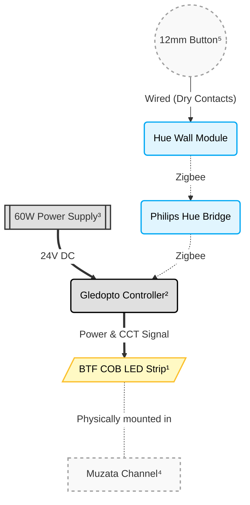
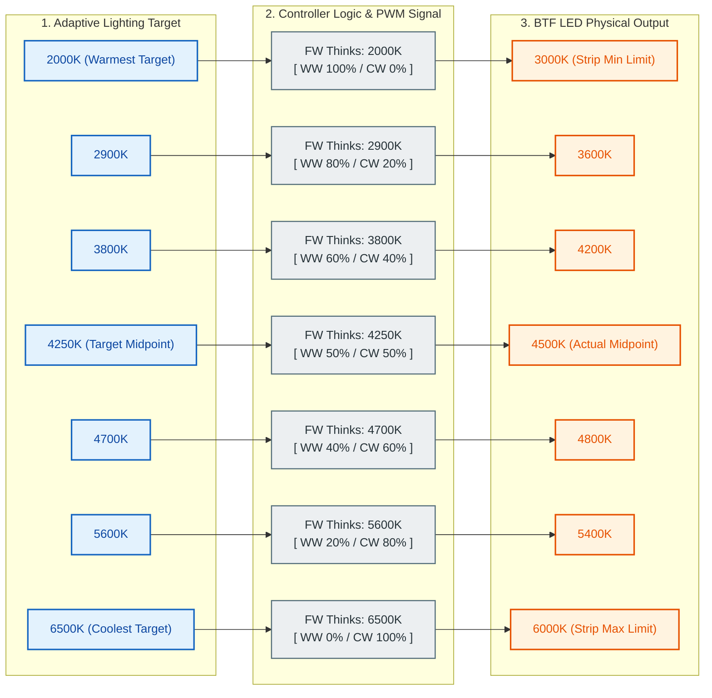

My kitchen counter was too dark, and I was concerned about cutting my fingers 🩹. I needed light. Every lighting solution seemed too bulky, dim, or restrictive. I’m sensitive to bad lighting and have high standards when it comes to products. This led me to the usual conclusion: building something to meet my needs.



## Too Darn Dark

We have a 1970s kitchen. It has the original cabinets and quite possibly original Formica countertops, too. There are overhead ceiling fixtures that create a nice soft ambiance in the kitchen and dining area, but the dark-stained cabinets block quite a bit of light over the prep area.

*My kitchen counter with shadows on the sunniest of days*

We have kids, so I spend a good amount of time cutting up foods into small pieces. But the kitchen was so dark that I was struggling to see while cutting darker foods (e.g., red grapes).

When I measured the lighting on the kitchen countertop, I was reading a measly **90 Lux** on the surface. That's comparable to a dark overcast day outdoors. That's awful.

According to the official guidelines in the IES 'Lighting for Interior and Exterior Residential Environments' (RP-11-17), lighting the horizontal task plane of a visual task area in a kitchen should hit ~50 footcandles (500 Lux) for adults ages 25 to 65.

I needed wayyyy more light. 💡

## Lighting Options Explored

Here are lighting options I explored:

- Countertop lamp
  - ❌ Bad shadows and not easily controllable.
- Brighter ceiling lights or track lighting
  - ❌ Shadows are still a problem since there are cabinets above my counter and people who stand around them.
- LED strip below cabinet
  - ✅ Most popular option for lighting countertops and for a good reason. Lighting can be spread out and doesn't easily get blocked by obstructions.

Hitting a quick checklist, I decided to go with an LED strip. But which one? 

I wanted my solution to involve smart lighting so it could be controlled or changed. I didn't feel like abandoning my Hue bridge to run my own Zigbee controller (or switching ecosystems). (Ironically) that felt like too much work to migrate. This limited my options.

> There are a handful of third-party Zigbee devices that work (unofficially) with the Philips Hue bridge. I'm sure this list is always changing.

- Hue Essential/Flux/Solo:
  - ❌ Dealbreaker: LED density is too low; this creates a non-uniform look.
- Hue OmniGlow: 
  - ✅ Adequate LED density.
  - ✅ ~900 lumens per meter of brightness. 
  - ❌ The diffuser casing means it can't bend 90° corners and lay flat.
  - ❌ Didn't exist when I started this project (April 2025).
- DIY LED Strip/controller
  - ✅ I get to choose my own components
  - ❌ I _have_ to choose my own components
  - ❌ Philips Hue could suddenly break third-party devices as they did back in 2015.

## DIY Route

 I ended up going the DIY route. In order to DIY, I would need a few components.

 1. LED Strip
 2. LED Controller (Zigbee compatible that works with the Hue bridge)
 3. Power supply
 4. (Optional) LED Strip channel
 5. (Optional) Physical button/switch

Here's a diagram of the items I selected for each component with a breakdown further below:

### 1. LED Strip

This is arguably the most important component of my setup. If the LEDs look bad, nothing else matters. 

My objective was to find an LED strip with tunable whites and a high CRI (color rendering index). Bonus if I could find something with a high density of LEDs.
 
I selected the 24V BTF-LIGHTING CCT (3000K-6000K) COB LED Strip. 

*Testing the BTF LED strip and Gledopto controller with a Philips Hue bridge*

It is reasonably priced, supports a color range that I want, and meets my technical requirements. Let's break the product down.

- `24V` is the voltage that the LED strip will run on. A higher voltage delivers the same power using less current, allowing longer runs without fading.
- `CCT` (Correlated Color Temperature) means I can change how cool or warm the color output is.
- `3000K-6000K` is the color temperature range that the LED strip supports. 3000K is a very warm white, while 6000K is much cooler and similar to noon daylight. 
- `COB` (Chip-on-board) is a tightly packed formation of LEDs on the strip to create a uniform color/brightness.

### 2. LED Controller

The product I selected that met my needs was the `Gledopto GL-C-204P`. 

*Gledopto GL-C-204P controller mounted under the cabinet*

My primary reasons for selecting this exact LED controller were:

- Supports CCT (Correlated Color Temperature)
- 24 VDC
- Zigbee (claims compatibility with Philips Hue bridge)
- Can change the PWM (Pulse Width Modulation) frequency to reduce high-pitched whine on certain power supplies or flickering with LED strips.
- Built-in dry-contact switch (but this didn't work as I expected; more on the [button challenges below](#button-challenges)).

### 3. Power Supply

It's recommended to pair LED lights with a power supply that has at least a 20% higher capacity than the maximum power consumption of the LED run. Since I was calculating a maximum power consumption of 35 Watts for my run, I sized up to a 60 Watts power supply:

- LightingWill 24V DC LED Driver 60 Watts IP67 Power Supply

*LED components mounted in place*

It wires directly to my LED controller, easily mounts under the cabinet, and is protected from any liquid splashes.

### 4. LED Strip Channel

My selected CCT LED strip uses COB (chip-on-board) style lighting where the LEDs are packed pretty densely. Plus, the diffuser on the LED strip already makes them look pretty smooth. So why would I want to put this inside of another metal channel with an additional diffuser layer?

Because it's ugly.

The wooden cabinets above the kitchen prep area have a flush bottom. If I wanted to mount my LEDs to that surface, my strip would be fully visible, and I think that's ugly. Not to mention the heat/cool cycles would likely peel it away from the wood over time. There are also a few "claims" that aluminum channels can significantly increase the lifespan of an LED strip as they work like a heatsink to draw heat away from the LEDs. Sounds plausible to me.

My LED strip is ~10mm wide, so I went with this low-profile option:

- Muzata 6.6FT Black LED Strip Channel with Milky Diffuser U102

I was drawn to this style because the channel came in 6.6-foot lengths. This meant it could go the entire length of my cabinet in a single channel (no unsightly seams for light to leak out).

The diffuser was also flat, which helped direct the light downwards and prevented it from straying sideways into my face while at the counter.

The install was straightforward. Measure thrice, cut the (thin-walled) aluminum channel with a metal saw, and clip it to the brackets under the cabinet. The result is quite flush!

*Muzata LED Strip Channel installed*

I decided to route it alongside the edges of my cabinet because I think it blends in very well.

I drilled two additional holes through the cabinets. One for the LED cables (surrounded by a grommet) and another for the physical momentary button. Which leads me to...

### 5. Physical Button

My personal rule is that all smart lighting in my house requires a physical switch to control it. 

I planned to wire up a 12mm black aluminum momentary push button to the LED controller's dry-contact input. I _did_ use the switch, but I ended up wiring it up to a (discontinued?) Hue Wall Module instead. More on the [button challenges](#button-challenges) below.

*Installed control button*

## Roadblocks

I ran into three major roadblocks during the course of the project and had to make adjustments. 

### Button Challenges

I was originally going to use the hard-wired dry-contact switch input on the Gledopto controller to avoid the extra network hop. But after testing, I found that when I use the physical button to control the lights, the controller doesn't update its state to the Hue bridge. The state only updates when the Hue bridge decides to poll the devices on the network; roughly every 30s-60s. 

Normally this wouldn't be a problem, but I'm also pairing my LEDs with [`Adaptive Lighting`](https://github.com/basnijholt/adaptive-lighting).

#### Adaptive Lighting

[`Adaptive Lighting`](https://github.com/basnijholt/adaptive-lighting) is a fantastic project that _continuously_ adjusts the brightness and color of connected lights throughout the course of a day to match the sun's light. I pair `Adaptive Lighting` with my lighting in [Home Assistant](https://www.home-assistant.io/) to enable this for all of my smart lights. It goes something like this. 

Warm and dim lighting in the morning. As the day progresses, the lights will transition to cooler and brighter. As the evening approaches, the lights will continue their transition cycle back to warmer and dimmer colors. This isn't happening in chunks, but instead _continuously_ and _smoothly_ through the entire day. It's like following the sun, but inside. This creates a relaxing ambiance to match your body's natural cycle. 

This creates my problem.

1. When I turn `off` the LED strip via the dry-contact button, the Gledopto controller fails to publish the `off` state to the Hue bridge (and, in turn, Home Assistant). 
2. Since Home Assistant thinks the lights are still `on`, the continuous `Adaptive Lighting` changes still get sent and turn the LED strip back on.

This _can_ be reduced by changing the update frequency of the `Adaptive Lighting` changes, but it can't eliminate this bug.

#### Workarounds

Reportedly, there is a possible bug with the update command from the Gledopto controller that isn't recognized by Hue, but might be by other third-party Zigbee controllers.

Supposedly, it might be related to the reporting of `OnOff`, `LevelCtrl`, or `genOnOff` with some additional configuration.

- <https://github.com/Koenkk/zigbee2mqtt/discussions/19379#discussioncomment-8750855>
- <https://github.com/Koenkk/zigbee2mqtt/issues/23661#issuecomment-3843098714>

Since I want to stay on the Hue Bridge, the solution I need is to operate the Gledopto controller by **pushing commands** to it rather than **polling** for state changes. 

Luckily, there is an odd (since discontinued?) Hue product that is perfect for what I need.

The original Philips Hue Wall Switch Module (US). The US version of the wall switch module is a battery-operated device that connects to switch signals and broadcasts those inputs over Zigbee to the Philips Hue bridge. This can then be programmed to change Hue lights or scenes. 

It's weird that it operates using battery power, considering you’re supposed to install it in your wall behind a light switch where power is already available... But I guess regulations and certifications get kinda complicated when you connect to mains power in the wall. Luckily, that’s perfect for me as my dry-contact button won’t be running on mains power!

### BTF Strip Problems

It's worth noting that I also ran into a few issues with the BTF light strip early on.

#### Bad LED Connection

About a week after I installed the LED strip, one of the sections refused to operate the cooler LEDs. It seemed to be damaged right next to the factory solder connection on the strip.

*Damaged LED strip at factory solder connection*

I reached out to BTF, and they immediately dispatched a replacement that arrived a few days later. 👍

#### Garbage Clips

The solderless clips sold by BTF for their CCT LED strip are garbage. They use vampire connectors, which are metal tabs that clamp down and pierce through the copper pads on the LED strip to make the connections. I tried to save time by using these, but I definitely lost more by going this route.

I assumed their solderless clips would be acceptable given the low voltage I was operating at, but I was wrong. When the LED strips heated up and expanded, they flickered due to the poor connection created by the solderless clips. 

I ended up ripping them out and soldering new connections. Only then did the flickering go away.

### Color Temp Correctness

The Gledopto GL-C-204P LED controller operates at a color range of **2000K-6500K** for _any_ CCT LED strip connected to it. This is not configurable (unless someone knows of a way to flash the controller and change these, but I haven't found any).

My BTF-LIGHTING 24V CCT COB LED Strip operates at **3000K-6000K**. 

This is a mismatch.

So if you tell the Gledopto controller to change the LEDs to **2000K**, it will send the `WW (Warm White) 100% / CW (Cool White) 0%` signal to the LED strip, which will display **3000K**. 

If you tell the Gledopto controller to change the LEDs to **6500K**, it will send the `WW (Warm White) 0% / CW (Cool White) 100%` signal to the LED strip, which will display **6000K**.

To make this work in my home, I adjust my [Adaptive Lighting](https://github.com/basnijholt/adaptive-lighting) range to compensate for this difference. For example, the LED strip temperature range in Adaptive Lighting uses **2000k-4800k**, while the other Hue bulbs in the room use **2000k-5500k**. It's _good enough_.

I've created a diagram to help explain what I mean.

## Results

I followed the directions from the manuals for each component to connect them together and pair them with the Hue bridge. It was a straightforward process.

With everything assembled, it looks great! The edge lighting creates a bright and evenly lit prep area along the entire counter surface. 

Here's a collage demonstrating the different warm and cool lighting on my counter at night.

*Collage demonstrating warm and cool LED lighting of the kitchen counter*

It's all running through my Philips Hue bridge and operating with [Adaptive Lighting](https://github.com/basnijholt/adaptive-lighting) inside of [Home Assistant](https://www.home-assistant.io/). As the day changes, my lighting does too. It even works as a convenient night light. 

Before my changes, the surface of the countertop was measuring **~90 Lux**. Now, I am measuring **~530 Lux** in the same spot! That's a _perceived_ brightness improvement of ~2.4X to the human eye.

Remember earlier when I mentioned we were trying to reach a Lux rating of 500+? I'm right on target! 🎯
