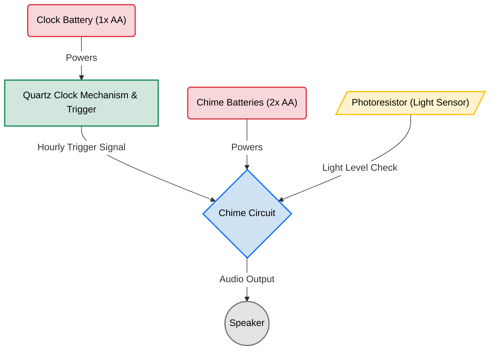

On Father's Day this past year, my wife thrifted and gifted me a vintage Audubon bird clock. At the top of each hour, the clock plays the bird call from one of the twelve birds on the face of the clock. There's a nifty photoresistor (light sensor) that quiets the clock down when there is less light, and raises it to full volume in the day. It's quite fun for the kids and me!

I was excited for this as I had never heard of one before. Before my kids could go down for their nap, I slammed a nail in the wall and hung it up. But as soon as I did, I recoiled inside. **tick** tick **tick** went the second hand. It echoed through our walls. The ticking made me _uncomfortable_. Which is _super ironic_ considering the fact that the bird clock is _supposed_ to make noise every hour. But that was different. Bird calls are enjoyable. The ticking was a menace.

This is my sidequest on how I silenced my bird clock tick-tock.



## What I Have

I have a bird clock that makes a ticking noise, and I don't want to hear it. I considered stuffing the clock with sound-deadening material, but that probably wouldn't completely eliminate the sound. Another idea I had was to remove the second hand, as that would remove the rattle coming from the second hand. But then the clock would be losing some useful temporal resolution at a glance.

Flipping the bird clock over revealed its "Mini Quartz Movement" on the back. It measures 2-1/8" x 2-1/8" x 5/8" (56mm x 56mm x 16mm). Luckily, it's a standard size. 

I've heard (or haven't heard?) silent clocks before. A quick search confirmed this. Those non-ticking clocks are usually referred to as continuous sweep clock movements. If the name wasn't obvious, these are clock movements that don't "tick", but instead the second hand produces a continuous (silent) motion.

Since my parts were standard size, all I needed to do was find a continuous sweep clock movement with the same dimensions.

Unfortunately, this is where things got a little bit complicated.

## Hourly Chime

My bird clock works like this. 

Its mini quartz clock mechanism moves the hands around. Inside the movement box is a mechanical leaf switch that triggers when the minute hand reaches the 12 o'clock position. When this happens, it activates a separate "chime circuit" which plays the hourly chime.

The chime circuit is an indexing music player with 12 tracks. Each time it is triggered, it advances to the next song on its track list before looping back to the start. When the batteries are replaced, the index is reset, and it will play its first track the next time it's activated.

Additionally, the clock contains a photoresistor (or light sensor) wired in. The more light the sensor receives, the louder the bird clock sound is. So if the room is dimly lit, it will be quiet. 

The problem is that while looking for a suitable replacement, I struggled to locate a clock movement that had a continuous sweep _and_ an hourly trigger movement. Nearly every single clock movement with an hourly trigger movement was using a step movement for the hands (which means **tick** tick **tick**). 

It wasn't until I stumbled upon the `Mini Trigger Continuous Sweep Quartz Movement - 19/32" Hand Shaft` that my luck turned around. 

> Item `#33886` on <https://timesavers.com> at the time of writing

This was everything I needed. It used a continuous sweep, the movement box was the correct dimensions, the shaft was short enough to fit under the glass, and it had an hourly chime!

It's possible that I had trouble searching because I don't yet understand what makes the clock world _tick_. I'm sure there are bespoke websites, magazine catalogues, or "a guy" that might have the parts I'm looking for. After all, I was only scratching the surface to find it. But this product was now my lifeline. 

The store listing noted that the clock movement shaft only worked with American "i" Shaft hands. This was different from what I was using before. So I picked up a multi-pack of "i" shaft hands online to toy around with.

I made my order (and grabbed a spare clock movement).

*Left: Original stepping sweep clock movement Right: New continuous sweep clock movement*

## Teardown

Taking the clock apart was pretty straightforward. 

### Bezel Screws

It's necessary to remove the glass bezel because the clock hands are attached to the clock movement shaft. This means you can't remove the clock movement from the case until the clock hands are removed from the shaft.

Removing the bezel screws provides access to the glass clock face. However, it's glued into place. This can be separated by first softening the old adhesive with a hair dryer. Try to avoid anything hotter, or you might damage the old plastic. Once the adhesive softens, a guitar pick can slide under the glass rim to break apart the bond without cracking the glass.

Once the glass is removed, the clock hands can come off. In my case, the clock hands were friction-fit. I used some plastic pry tools to pop them off. There are probably better specialty tools that can be used. In my case, I knew they wouldn't fit on the new clock movement, so I didn't care. 

*Figuring out how to remove the original hands on the Audubon bird clock*

### Casing Screws

After popping off the clock hands, the casing screws were the only thing keeping the clock movement attached.

Removing them provided access to the internals. 

*Interior wiring of the Audubon bird clock*

Above, you can see that the clock movement (black) has two wires connecting to another (green) board. That board is the clock chime circuit. A quick minute of desoldering later, it was detached. 

## Assembly

When everything came, I snipped off the connector on my new clock movement and soldered the two wires directly to the clock chime circuit (just as the original was before). 

I pushed down the new hands, adjusted the movement, and reset the chime circuit. When the hands passed 12:00, the great horned owl hooted away. 🦉

*Audubon bird clock with the new clock movement in the back*

Since my test worked, all I needed to do was finish the assembly.

As my Audubon clock was one of the older ones, its lens was still made out of glass instead of acrylic. I didn't trust the bezel to hold the glass lens in place by itself, so I used some G-S Hypo Cement to reapply the adhesive. This adhesive sets quickly, remains slightly flexible, dries clear, and easily applies with a needle nozzle. It's widely used in jewelry making and for other watch repairs. 

*Audubon bird clock with a continuous sweep and new hands*

## Results

It works!

Note: The second hand isn't what controls the hourly trigger signal. That signal comes from the _minute/hour hands_. The second hand is something that moves independently of the other two hands. Which means it's not guaranteed to line up with the hourly chime (especially if there is any drift).

In my video, at precisely 09:00:10, the hourly trigger signal goes off and activates the hourly chime. At that time, you'll hear a "click" followed immediately by a belted kingfisher as the 9 o'clock bird. 



## Conclusion

I feel like I'm in such a niche. Someone who wants a clock that chimes hourly bird calls, but doesn't tick. I've learned a _little_ bit more about what makes clocks _not_ tick. 
