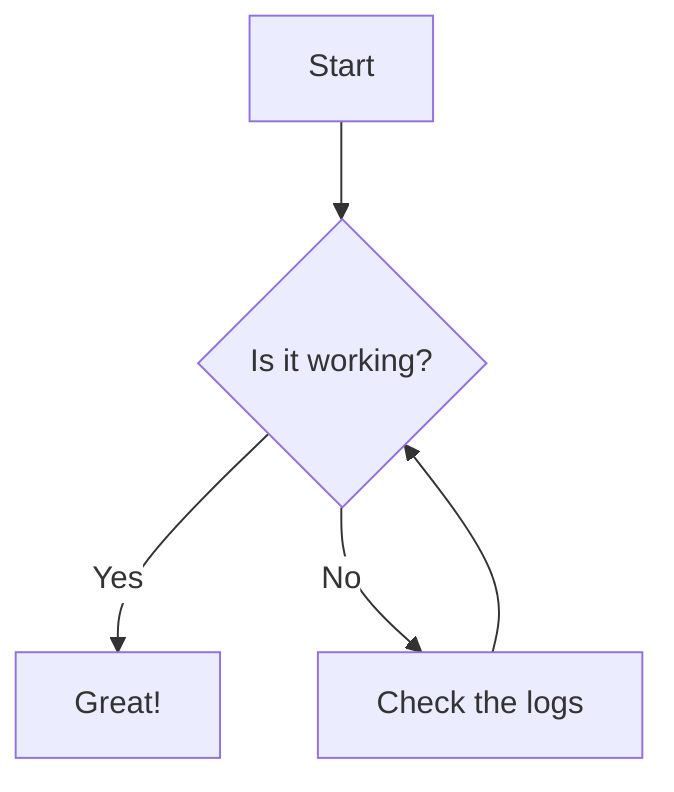

# Overview

- Explain why I need a remote microphone relay (server, plus other mics)
- Why I chose my mic (sensitive)
- Why I didn't build my own capsule (not my skill area to test or confirm)
- auto startup
- mediamtx
- watchdogs
- Ground loop issue. Solved by grounding to an already grounded utility sink using a tiny wire
- Results with and without grounding
- Mounted under deck to help prevent saturation. further away from bird bath water noise. Can further isolate with a shock mount if I need to since the deck is tied to the house.


# https://pimylifeup.com/raspberry-pi-docker/

Raspberry Pi Imager

https://www.raspberrypi.com/software/

Use Raspberry Pi OS Lite

https://www.raspberrypi.com/software/operating-systems/


sudo apt update
sudo apt upgrade -y

curl -sSL https://get.docker.com | sh

sudo usermod -aG docker $USER

logout
# or `sudo reboot`

# Check groups
groups

# Should see `docker` in the list of groups

# Test
docker run hello-world

# Identify mic
arecord -l

```markdown
You will see output that looks something like this:

**** List of CAPTURE Hardware Devices ****
card 1: Device [USB Audio Device], device 0: USB Audio [USB Audio]

Note the card number and device number. In this example, it's Card 1, Device 0. In Linux terminology, this translates to hw:1,0. Keep this handy.
```

vi ~/mediamtx.yml

```yaml
paths:
  birdmic:
    # Optimized for a sheltered/wind-protected location. 
    runOnInit: ffmpeg -f alsa -thread_queue_size 1024 -ac 2 -ar 48000 -i hw:1,0 -af "highpass=f=120" -ac 1 -c:a aac -b:a 256k -f rtsp rtsp://localhost:8554/birdmic
    runOnInitRestart: yes
```

vi ~/docker-compose.yml

```yaml
services:
  mediamtx:
    # We MUST use the ffmpeg tag so the runOnInit command works
    image: bluenviron/mediamtx:latest-ffmpeg
    container_name: mediamtx
    # Host network mode is highly recommended for RTSP/UDP traffic on weak hardware like the Pi 3
    network_mode: host 
    restart: always
    devices:
      - /dev/snd:/dev/snd # Passes the physical sound cards into the container
    volumes:
      - ./mediamtx.yml:/mediamtx.yml # Mounts your config file
```

docker compose up -d

# Test logs

docker logs mediamtx

# Then access it

rtsp://10.0.0.123:8554/birdmic

# Enable Watchdog

sudo vi /etc/systemd/system.conf

## Add the following lines to the bottom

```
RuntimeWatchdogSec=15
RebootWatchdogSec=5min
```

```
sudo systemctl daemon-reload
(or reboot)
```

## Install software watchdog

```
sudo apt install watchdog
```

sudo vi /etc/watchdog.conf

```
watchdog-device = /dev/watchdog
watchdog-timeout = 15
max-load-1 = 24
interface = wlan0
```

### Enable the watchdog

```
sudo systemctl enable watchdog
sudo systemctl start watchdog
```


Lorem ipsum dolor sit amet consectetur adipiscing elit. Quisque faucibus ex sapien vitae pellentesque sem placerat. In id cursus mi pretium tellus duis convallis. Tempus leo eu aenean sed diam urna tempor. Pulvinar vivamus fringilla lacus nec metus bibendum egestas. Iaculis massa nisl malesuada lacinia integer nunc posuere. Ut hendrerit semper vel class aptent taciti sociosqu. Ad litora torquent per conubia nostra inceptos himenaeos.

<!-- ## Table of Contents -->



## Example Post

Lorem ipsum dolor sit amet consectetur adipiscing elit. Quisque faucibus ex sapien vitae pellentesque sem placerat. In id cursus mi pretium tellus duis convallis. Tempus leo eu aenean sed diam urna tempor. Pulvinar vivamus fringilla lacus nec metus bibendum egestas. Iaculis massa nisl malesuada lacinia integer nunc posuere. Ut hendrerit semper vel class aptent taciti sociosqu. Ad litora torquent per conubia nostra inceptos himenaeos.

## Callout

> Example callout

[This is a link](https://example.com)

## Image

*Raspberry Pi 2 with a fixed ground wire running to a sink*

*Raspberry Pi 2 with a fixed ground wire running to a sink*

*Raspberry Pi 2 with a temporary GPIO ground wedged into a utility sink gap*

*SO.1 Omni Microphone magnetically mounted under a deck joist*

## Remove Metadata

```bash
exiftool -all= -overwrite_original -r .

exiftool -gpslatitude .
```

## Mermaid Diagram



## Details

<!-- If an HTML tag has an attribute markdown="block", then the content of the tag is parsed as block level elements. -->
<!-- https://kramdown.gettalong.org/syntax.html#html-blocks -->
<details markdown="block">

<summary>[YAML] Example Configuration</summary>

```yaml

template:
  - trigger:
      - platform: time_pattern
        # Let's be honest, we don't need to check often. 
        # But 5 minutes should be reactive enough if I need to correct an event date.
        minutes: "/5" 

```
</details>
