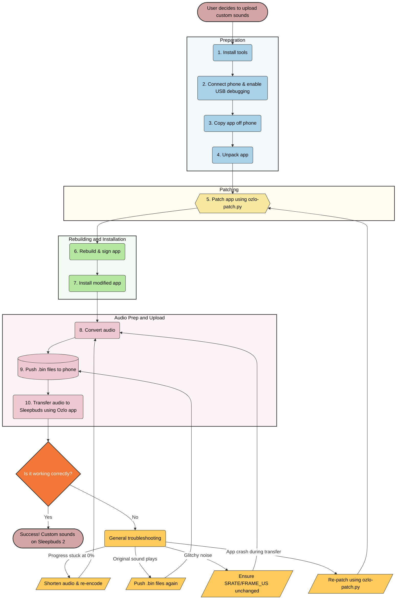

My noise blocking journey started 2019 when I was trying to mask the sound of HVAC ducting popping in the middle of the night when the heat turned on. I picked up a noise machine and [hacked ESPHome control into it](/blog/2019/02/hacking-my-noise-machine/). But it wasn't enough to drown out the louder noises while trying to sleep. I needed something more.

<!-- ## Table of Contents -->



## Noise Masking Journey

Desperate for a quiet sleep, I purchased the original Bose Noise-masking Sleepbuds. They were unusually small, had a _great_ battery life, and helped block the noises that were waking me up. They were fantastic except for the whole battery failure part, which led to all products being recalled. Luckily, Bose was offering a free replacement with the Bose Sleepbuds II.

Around this time, Bose also released a handful of new sound effects such as "Songbirds" that I fell in love with. In hindsight, gravitating toward bird sounds makes a lot sense now. 

Years later, Bose discontinued their Sleepbuds line after failing to reach the level of adoption they wanted. Ozlo, a company formed by many former Bose employees, was created. Ozlo purchased the intellectual property and research from Bose, and brought the Sleepbuds back. 

I backed the Ozlo Sleepbuds on Indiegogo and used them for over 2 years without any issues. Unfortunately, my favorite "Songbirds" masking effect was no longer present. The Ozlo Sleepbuds were a bit different as they allowed a user to _stream_ their own audio over Bluetooth instead of relying on the onboard sounds.

However, whenever I did this, the battery in my Sleepbuds wouldn't make it through the night. I tried lowering the volume and using the power saving modes (which stops playback after you've fallen asleep), but then the Sleepbuds no longer masked noises. So I settled for some of their built-in sounds.

I gave up on the idea of streaming audio until...

### Ozlo Sleepbuds 2

Ozlo recently launched their Sleepbuds 2. Early reviews claimed that the battery life had been significantly increased. As my current Ozlo Sleepbuds were starting to show their age with a weakened battery life, I decided it was time to upgrade.

If you're new here, I'm [sensitive to sounds](/blog/2026/08/silencing-bird-clock-tick-tock/).

After the first night of sleeping, I realized the battery life had been increased substantially. I was only using ~50% of my battery overnight (instead of 90%+ on the previous generation). I figured this would be a good time switch from the onboard sounds and instead try streaming my old "Songbirds" loop on the Ozlo Sleepbuds 2. 

They made it streaming through the night with plenty of battery to spare! Which was very impressive. But it felt kinda clunky. Every night, I'd have to pause the built-in sounds on my sleepbuds, open up a 3rd party music player, and loop my Songbirds track. 

Other inconveniences include:

- Bluetooth streaming drains an additional ~15% of my battery each night.
- If I step out of range in the middle of the night to use the bathroom, the sounds crackle and fizz in my ears.
- If my phone reboots to install OS updates, app updates, or anything crashes in the middle of the night, the audio stops.

These inconveniences annoyed me so much that I found myself determined to transfer my favorite masking sounds back onto my Sleepbuds.

So I did.

## Uploading Custom Sounds to Ozlo Sleepbuds 2

> This process is _incredibly technical_. I am **not planning to support** future versions of the Ozlo app or Sleepbuds. Instead I am providing my research and tooling that I used to successfully upload custom sounds to my Ozlo Sleepbuds 2 _today_. This may continue to work in the future.
>
> It is possible to point an AI agent to this page (like Claude) to help guide you through all of the steps and run them from your machine. **Run this at your own risk**.
>
> As I have accomplished my goal of transferring my sounds, **I won't be taking this further**.

### Upload Options

I came up with four possible approaches to get audio onto my Ozlo Sleepbuds 2.

1. Bribe someone at Ozlo to do it for me. 💸
  - ❌ I'm not sure I can afford this. 
  - ❌ Unable to share approach.
2. Create my own proxy layer (like Charles Proxy during the PS3 days) to intercept audio fetch calls being made to Ozlo's servers and redirect them to my own files.
  - ❌ Requires me to understand how their servers worked and how Ozlo packages its sound blobs (which I can't really inspect)
  - ❌ Might not be able to bypass SSL requests from within the Ozlo app
3. Research the protocols being used over Bluetooth between the Ozlo app and the Sleepbuds to replicate the transfer process myself.
  - ✅ Very complete solution. Unlikely to break unless a new firmware significantly changes things.
  - ❌ Requires a lot of work since I'd need to make my own app and understand _most of it_.
4. Patch the app with hooks to point at my own local file when the app transfers sounds over.
  - ✅ Fastest solution to apply.
  - ❌ Very brittle. Patches will usually only work on specific versions of the Ozlo app and can easily break the next time the app is updated. 
  - ❌ Only works as long as the app is supported on modern devices.

I went with `Option 4`, patching the Ozlo app, because it seemed like the quickest to implement. If they ever stop supporting the app, I guess I'll have to go back and create my own like [chillee151/SleepBuds2Revival](https://github.com/chillee151/SleepBuds2Revival).

Even better, once the sounds are loaded onto the Sleepbuds, the patches don't need to hang around anymore. So future app updates shouldn't really matter!

With the help from Claude, **it only took me 3 hours** to research how the app worked, how the audio was encoded, where to patch the code, and successfully transfer over a truncated copy of my Songbirds sound.

That kind of speed from idea to delivery astonishes me. Here's how to do it.

### Patching the Ozlo App

> 🙏 Ozlo, if you're reading this, please don't _intentionally_ block users from doing this by adding additional firmware checks or app obfuscation. Some of us use these Sleepbuds loaded with other sounds for **accessibility reasons** and would like our preferred masking sounds to continue working without our phone. 💙

The section outlines how I patched the Ozlo app and uploaded my own local sound loops onto the Ozlo Sleepbuds 2. This method successfully transferred custom sound loops to to both my "Original Ozlo Sleepbuds" and "Ozlo Sleepbuds 2".

The risk to complete this is low. Nothing here touches the firmware on the Sleepbuds. The worst outcome I hit was a slot holding broken audio. This can be fixed by transferring the sound again.

Depending on your experience, I imagine most people can complete this in 1-4 hours the first time (strongly dependent on technical expertise). After that, it should only take 5-15 minutes to set up a new sound file.

When a user transfers new sounds to their Sleepbuds:

1. The Ozlo app downloads the specified sound from Ozlo's servers and saves it as a file stored on the phone. 
  - We patch the app to have it read back our custom sound file that we push to the phone.
2. The app runs a checksum on the sound file before transferring to make sure it matches the value for the downloaded sound file. If it's intact, the app will start copying the sound over to the Sleepbuds. 
  - We patch the app's checksum to always succeed, tricking the app to accept our swapped sound file.

If you want to build your own tool, the [additional technical findings](#additional-technical-findings) are worth reviewing.

### Prerequisites

- macOS or Linux
  - Windows via WSL is untested
- A real **Android** device (not an emulator) connected over a USB cable
  - I have no idea how to patch iOS apps
- The Ozlo app installed with Sleepbuds already paired and working
  - I used Ozlo app version `2.62.3 (3041)` released on `August 6, 2026`
- Audio in any format that `ffmpeg` can read
  - Should be <= `30.55 seconds`
  - Should loop (or use a crossfade to hide the loop)
- Internet
  - Every transfer still hits Ozlo’s servers, even though the custom sound replaces theirs.

These were my firmware versions on my Ozlo Sleepbuds 2:

- Smart Case: `02.11.2606025`
- Left Sleepbud: `02.11.2606011`
- Right Sleepbud: `02.11.2606011`
- Bluetooth: `02.11.2606007`

### Overview

---



---

### Helper Scripts

Below are the two helper scripts that assist in the transfer of custom sounds to the Sleepbuds.

#### ozlo-encode.py

Converts standard audio files into the specific LC3 audio format (.bin files at 48 kHz, mono, 96 kbps) that the Sleepbuds require to play.

<!-- If an HTML tag has an attribute markdown="block", then the content of the tag is parsed as block level elements. -->
<!-- https://kramdown.gettalong.org/syntax.html#html-blocks -->
<details markdown="block">

<summary>ozlo-encode.py</summary>


#!/usr/bin/env python3
"""
ozlo-encode.py - convert any audio file into Ozlo Sleepbuds sound files.

    python3 ozlo-encode.py mysound.wav
    python3 ozlo-encode.py mysound.wav --frames 2899   # shorter, if you want it

Creates: mine_left.bin  and  mine_right.bin

By default this uses the full length the Sleepbuds accept: 372,728 bytes, which is
3055 frames or 30.55 seconds. 3056 frames is refused and the transfer never
starts. The cap is only a maximum -- audio shorter than it is left alone.

If a transfer never starts on your hardware, these numbers came from one pair of
buds on one firmware. Try --frames 2899, the size of Ozlo's own stock sound.

Author: Anthropic Claude
Model: claude-opus-5, claude-opus-4-8
Date Generated: August 2026
Script Version: 2026.8.0

Note: This file was authored entirely by AI based on user prompts. 
Human intervention was limited to prompt engineering, light review, and testing 
by Kyle Niewiada.

Requires: ffmpeg and liblc3 installed.
  macOS:  brew install ffmpeg liblc3
  Linux:  sudo apt install ffmpeg liblc3-dev   (or build github.com/google/liblc3)
"""
import ctypes, ctypes.util, glob, os, shutil, struct, subprocess, sys, tempfile

# --- Ozlo's format. Do not change these; the Sleepbuds require them. ---
SRATE       = 48000
FRAME_US    = 10000     # 10 ms
FRAME_BYTES = 120       # = 96 kbps
MAX_BYTES   = 372_728   # the limit: 3055 frames / 30.55 s. 3056 frames is refused.
MAX_FRAMES  = 3055
STOCK_BYTES = 353_696   # size of Ozlo's own stock sound; fallback if your Sleepbuds differ
FRAME_SAMPLES = SRATE * FRAME_US // 1_000_000   # 480
HEADER_BYTES  = 18
PER_FRAME     = FRAME_BYTES + 2   # 2-byte length prefix per frame
PCM_S16 = 0

def die(msg):
    print("\nERROR: " + msg + "\n", file=sys.stderr)
    sys.exit(1)

def find_liblc3():
    cands = []
    p = ctypes.util.find_library("lc3")
    if p:
        cands.append(p)
    for base in ("/opt/homebrew", "/usr/local", "/usr", "/opt/local"):
        cands += glob.glob(base + "/lib/liblc3*.dylib") + glob.glob(base + "/lib*/liblc3*.so*")
    cands += glob.glob("/opt/homebrew/Cellar/liblc3/*/lib/liblc3*.dylib")
    for c in cands:
        try:
            return ctypes.CDLL(c)
        except OSError:
            continue
    die("could not find liblc3.\n"
        "  macOS:  brew install liblc3\n"
        "  Linux:  sudo apt install liblc3-dev  (or build github.com/google/liblc3)")

def check_ffmpeg():
    for t in ("ffmpeg", "ffprobe"):
        if not shutil.which(t):
            die(f"{t} not found on PATH.\n  macOS: brew install ffmpeg\n  Linux: sudo apt install ffmpeg")

class Encoder:
    def __init__(self, lib):
        self.lib = lib
        lib.lc3_encoder_size.restype = ctypes.c_uint
        lib.lc3_setup_encoder.restype = ctypes.c_void_p
        n = lib.lc3_encoder_size(FRAME_US, SRATE)
        if not n:
            die("liblc3 rejected the encoder settings (unexpected).")
        self.mem = ctypes.create_string_buffer(n)
        self.enc = lib.lc3_setup_encoder(FRAME_US, SRATE, 0, self.mem)
        if not self.enc:
            die("liblc3 failed to initialise the encoder.")
        self.out = ctypes.create_string_buffer(FRAME_BYTES)

    def frame(self, pcm_bytes):
        r = self.lib.lc3_encode(ctypes.c_void_p(self.enc), PCM_S16,
                                pcm_bytes, 1, FRAME_BYTES, self.out)
        if r != 0:
            die(f"liblc3 encode failed (code {r}).")
        return self.out.raw[:FRAME_BYTES]

def to_pcm(src, tmpdir):
    """Decode to 48 kHz mono 16-bit, one raw file per channel."""
    left  = os.path.join(tmpdir, "l.raw")
    right = os.path.join(tmpdir, "r.raw")
    chans = subprocess.run(
        ["ffprobe","-v","error","-select_streams","a:0",
         "-show_entries","stream=channels","-of","csv=p=0", src],
        capture_output=True, text=True).stdout.strip()
    common = ["-ar", str(SRATE), "-c:a", "pcm_s16le", "-f", "s16le"]
    if chans.startswith("2"):
        subprocess.run(["ffmpeg","-hide_banner","-loglevel","error","-y","-i",src,
            "-filter_complex","channelsplit=channel_layout=stereo[a][b]",
            "-map","[a]",*common,left, "-map","[b]",*common,right], check=True)
    else:
        subprocess.run(["ffmpeg","-hide_banner","-loglevel","error","-y","-i",src,
            "-ac","1",*common,left], check=True)
        right = left
    return left, right

def write_sound(lib, pcm_path, out_path, max_bytes=MAX_BYTES):
    pcm = open(pcm_path, "rb").read()
    max_frames = (max_bytes - HEADER_BYTES) // PER_FRAME
    frames = min(len(pcm) // 2 // FRAME_SAMPLES, max_frames)
    if frames == 0:
        die("input audio is shorter than 10 ms.")
    clipped = (len(pcm) // 2 // FRAME_SAMPLES) > max_frames
    nsamples = frames * FRAME_SAMPLES
    header = struct.pack("<9H", 0xCC1C, 18, SRATE // 100, FRAME_BYTES * 8, 1,
                         FRAME_US // 10, 0, nsamples & 0xFFFF, nsamples >> 16)
    enc = Encoder(lib)
    buf = bytearray(header)
    step = FRAME_SAMPLES * 2
    for i in range(frames):
        buf += struct.pack("<H", FRAME_BYTES) + enc.frame(pcm[i*step:(i+1)*step])
    open(out_path, "wb").write(bytes(buf))
    return frames, len(buf), clipped

def warn_if_oversize(size):
    """The default cap is the ceiling, so this only fires on an explicit override."""
    if size <= MAX_BYTES:
        return
    print(f"\n  WARNING: {size:,} bytes is over the {MAX_BYTES:,} byte ceiling "
          f"({MAX_FRAMES} frames / {MAX_FRAMES * FRAME_US / 1_000_000:.2f} s).\n"
          f"  The Sleepbuds refuse it: the transfer never starts and the progress bar sits at 0%.\n"
          f"  Drop --frames/--max-bytes to use the default.")

def main():
    args = [a for a in sys.argv[1:]]
    max_bytes = MAX_BYTES
    src = None
    i = 0
    while i < len(args):
        a = args[i]
        if a in ("--frames", "--max-bytes"):
            if i + 1 >= len(args):
                die(f"{a} needs a number after it.")
            try:
                n = int(args[i + 1].replace(",", "").replace("_", ""))
            except ValueError:
                die(f"{a} needs a whole number, got: {args[i + 1]}")
            if n <= 0:
                die(f"{a} must be positive.")
            max_bytes = HEADER_BYTES + n * PER_FRAME if a == "--frames" else n
            i += 2
        elif a.startswith("-"):
            die(f"unknown option: {a}")
        else:
            if src is not None:
                die("give exactly one input file.")
            src = a
            i += 1
    if src is None:
        sys.exit(__doc__)
    if not os.path.exists(src):
        die(f"file not found: {src}")
    if max_bytes != MAX_BYTES:
        cap_frames = (max_bytes - HEADER_BYTES) // PER_FRAME
        print(f"\n  Cap overridden: {max_bytes:,} bytes "
              f"({cap_frames} frames / {cap_frames * FRAME_US / 1_000_000:.2f} s)")
    check_ffmpeg()
    lib = find_liblc3()
    sizes = []
    with tempfile.TemporaryDirectory() as tmp:
        l, r = to_pcm(src, tmp)
        for pcm, out in ((l, "mine_left.bin"), (r, "mine_right.bin")):
            frames, size, clipped = write_sound(lib, pcm, out, max_bytes)
            secs = frames * FRAME_US / 1_000_000
            sizes.append(size)
            print(f"  {out}   {frames} frames   {secs:.2f} seconds   {size:,} bytes"
                  + ("   (trimmed to fit the cap)" if clipped else ""))
    warn_if_oversize(max(sizes))
    print("\nDone. Now run the two 'adb push' commands from the guide.")

if __name__ == "__main__":
    main()


</details>

#### ozlo-patch.py

Modifies the Ozlo app's code to swap in your local file during the transfer process and bypasses the checksum check so the custom audio isn't rejected.

<!-- If an HTML tag has an attribute markdown="block", then the content of the tag is parsed as block level elements. -->
<!-- https://kramdown.gettalong.org/syntax.html#html-blocks -->
<details markdown="block">

<summary>ozlo-patch.py</summary>


#!/usr/bin/env python3
"""Apply the two Ozlo Sleepbuds smali edits to an apktool output tree.

    python3 ozlo-patch.py work [--dry-run | --verify | --print-block]

Locates the code by method signature and field names, and reads the
version-specific values (.locals, register numbers) out of your own files.
Stops rather than guessing. Backups go to <tree>-ozlo-backups/.

Author: Anthropic Claude
Model: claude-opus-5, claude-opus-4-8
Date Generated: August 2026
Script Version: 2026.8.0

Note: This file was authored entirely by AI based on user prompts. 
Human intervention was limited to prompt engineering, light review, and testing 
by Kyle Niewiada.
"""
import argparse, os, re, shutil, sys

BEGIN = "# ===== OZLO INJECT BEGIN ====="
END   = "# ===== OZLO INJECT END ====="
SCRATCH = 7    # registers the injected block needs
MAX_REG = 15   # the invoke opcodes used can only address v0-v15

EMIT  = "emit(Lokhttp3/ResponseBody;Lkotlin/coroutines/Continuation;)Ljava/lang/Object;"
SAVE  = "saveSoundToFile(Lokhttp3/ResponseBody;Ljava/io/File;)V"
WDIR  = os.path.join("sounds", "data", "workers")
CRC   = "ExpectedCRC"
AREEQ = "Lkotlin/jvm/internal/Intrinsics;->areEqual(Ljava/lang/Object;Ljava/lang/Object;)Z"


class Stop(Exception):
    pass


def smali_files(root, pred):
    out = []
    for d, _, fs in os.walk(root):
        for f in fs:
            if not f.endswith(".smali"):
                continue
            p = os.path.join(d, f)
            try:
                t = open(p, encoding="utf-8", errors="replace").read()
            except OSError:
                continue
            if pred(p, t):
                out.append(p)
    return sorted(out)


def backup(root, path):
    # Outside the tree: .orig files under smali*/ confuse apktool b.
    dest = os.path.join(os.path.abspath(root.rstrip(os.sep)) + "-ozlo-backups",
                        os.path.relpath(path, root) + ".orig")
    os.makedirs(os.path.dirname(dest), exist_ok=True)
    shutil.copy2(path, dest)


# --- edit 1: substitute the downloaded file ---------------------------------

def find_inject(root):
    hits = smali_files(root, lambda p, t: WDIR in p and SAVE in t and EMIT in t
                       and "$file:Ljava/io/File;" in t)
    if len(hits) == 1:
        return hits[0]
    if not hits:
        loose = smali_files(root, lambda p, t: "saveSoundToFile" in t)
        if loose:
            raise Stop("No class matched all of: path under %s, the emit() signature, a $file "
                       "field.\nsaveSoundToFile does appear in: %s\nFind the one that saves the "
                       "download and reads the same File back, and patch it by hand. Anything "
                       "under main/presentation is the speaker preview, not the transfer."
                       % (WDIR, ", ".join(loose)))
        raise Stop("saveSoundToFile not found anywhere. Either this is not a disassembled Ozlo "
                   "APK, or the app is now obfuscated (in which case the code has to be found "
                   "from scratch).")
    raise Stop("Expected 1 sound-transfer class, found %d:\n  %s\nPatch only the one whose "
               "emit() saves the download and re-reads it." % (len(hits), "\n  ".join(hits)))


def read_emit(text, rel):
    lines = text.splitlines()
    start = next((i for i, l in enumerate(lines)
                  if l.strip().startswith(".method") and EMIT in l), None)
    if start is None:
        raise Stop("Found the class but not its emit() method in %s. Signature changed; patch "
                   "the method that calls saveSoundToFile by hand." % rel)
    end = next((i for i in range(start + 1, len(lines))
                if lines[i].strip() == ".end method"), len(lines))

    loc = next((i for i in range(start, end)
                if re.match(r"\.locals\s+\d+$", lines[i].strip())), None)
    if loc is None:
        raise Stop("emit() has no readable .locals line in %s." % rel)
    n = int(lines[loc].split()[1])

    saves = [i for i in range(start, end) if SAVE in lines[i]]
    if len(saves) != 1:
        raise Stop("Expected 1 saveSoundToFile call inside emit(), found %d in %s. If 0, the "
                   "download no longer goes via a file and this approach needs rethinking."
                   % (len(saves), rel))
    return loc, n, saves[0]


def block(base, cls):
    f, ctx, zero, tmp, s, flag, lbl = (f"v{base + i}" for i in range(SCRATCH))
    return f"""
{BEGIN}
    # scratch registers v{base}-v{base + SCRATCH - 1} derived from .locals {base}
    iget-object {f}, p0, {cls}->$file:Ljava/io/File;

    iget-object {ctx}, p0, {cls}->this$0:Lcom/ozlo/vanwinkle/sounds/data/workers/SoundTransferWorker;

    invoke-virtual {{{ctx}}}, Landroidx/work/ListenableWorker;->getApplicationContext()Landroid/content/Context;

    move-result-object {ctx}

    const/4 {zero}, 0x0

    invoke-virtual {{{ctx}, {zero}}}, Landroid/content/Context;->getExternalFilesDir(Ljava/lang/String;)Ljava/io/File;

    move-result-object {ctx}

    if-eqz {ctx}, :ozlo_done

    invoke-virtual {{{f}}}, Ljava/io/File;->getName()Ljava/lang/String;

    move-result-object {tmp}

    const-string {s}, "left"

    invoke-virtual {{{tmp}, {s}}}, Ljava/lang/String;->contains(Ljava/lang/CharSequence;)Z

    move-result {flag}

    if-eqz {flag}, :ozlo_right

    const-string {s}, "mine_left.bin"

    goto :ozlo_have

    :ozlo_right
    const-string {s}, "mine_right.bin"

    :ozlo_have
    new-instance {tmp}, Ljava/io/File;

    invoke-direct {{{tmp}, {ctx}, {s}}}, Ljava/io/File;-><init>(Ljava/io/File;Ljava/lang/String;)V

    invoke-virtual {{{tmp}}}, Ljava/io/File;->exists()Z

    move-result {flag}

    if-eqz {flag}, :ozlo_done

    invoke-static {{{tmp}}}, Lkotlin/io/FilesKt;->readBytes(Ljava/io/File;)[B

    move-result-object {tmp}

    invoke-static {{{f}, {tmp}}}, Lkotlin/io/FilesKt;->writeBytes(Ljava/io/File;[B)V

    array-length {flag}, {tmp}

    new-instance {tmp}, Ljava/lang/StringBuilder;

    invoke-direct {{{tmp}}}, Ljava/lang/StringBuilder;-><init>()V

    const-string {lbl}, "INJECTED bytes="

    invoke-virtual {{{tmp}, {lbl}}}, Ljava/lang/StringBuilder;->append(Ljava/lang/String;)Ljava/lang/StringBuilder;

    invoke-virtual {{{tmp}, {flag}}}, Ljava/lang/StringBuilder;->append(I)Ljava/lang/StringBuilder;

    invoke-virtual {{{tmp}}}, Ljava/lang/StringBuilder;->toString()Ljava/lang/String;

    move-result-object {tmp}

    const-string {s}, "OZLOPATCH"

    invoke-static {{{s}, {tmp}}}, Landroid/util/Log;->e(Ljava/lang/String;Ljava/lang/String;)I

    :ozlo_done
{END}
"""


def patch_inject(root, dry):
    path = find_inject(root)
    rel = os.path.relpath(path, root)
    text = open(path, encoding="utf-8").read()
    if BEGIN in text:
        return "SKIP", rel, "already patched"

    loc, n, save = read_emit(text, rel)
    if n >= 10:
        raise Stop(".locals is already %d in %s, which usually means the file was patched and "
                   "the marker comment removed. Re-disassemble and run once on a clean tree." % (n, rel))
    top = n + SCRATCH - 1
    if top > MAX_REG:
        raise Stop(".locals %d would put the scratch registers at v%d-v%d, but the invoke "
                   "opcodes in the block can only address v0-v%d. The block needs rewriting to "
                   "use low registers (or invoke-*/range)." % (n, n, top, MAX_REG))

    cls = next(l.split()[-1] for l in text.splitlines() if l.startswith(".class"))
    lines = text.splitlines(keepends=True)
    lines[loc] = re.sub(r"\.locals\s+\d+", f".locals {n + SCRATCH}", lines[loc])
    lines.insert(save + 1, block(n, cls))

    if not dry:
        backup(root, path)
        open(path, "w", encoding="utf-8").write("".join(lines))
    return "OK", rel, f".locals {n} -> {n + SCRATCH}, scratch v{n}-v{top}, injected after line {save + 1}"


# --- edit 2: stop the checksum rejection ------------------------------------

def find_crc(root):
    hits = smali_files(root, lambda p, t: WDIR in p and CRC in t and AREEQ in t)
    if len(hits) == 1:
        return hits[0]
    if not hits:
        raise Stop("No file under %s contains both '%s' and an Intrinsics.areEqual call. Find "
                   "where the expected CRC is compared to the actual one and neutralise that "
                   "comparison by hand. Read the branch first: forcing the wrong value can "
                   "reject every transfer." % (WDIR, CRC))
    raise Stop("Expected 1 file with the checksum comparison, found %d:\n  %s"
               % (len(hits), "\n  ".join(hits)))


def patch_crc(root, dry):
    path = find_crc(root)
    rel = os.path.relpath(path, root)
    lines = open(path, encoding="utf-8").read().splitlines(keepends=True)

    anchor = next(i for i, l in enumerate(lines) if CRC in l)
    eq = next((i for i in range(anchor, min(anchor + 120, len(lines))) if AREEQ in lines[i]), None)
    if eq is None:
        raise Stop("Found the %s log in %s but no areEqual within 120 lines." % (CRC, rel))

    mr = reg = None
    for i in range(eq + 1, min(eq + 30, len(lines))):
        m = re.match(r"move-result\s+(v\d+)$", lines[i].strip())
        if m:
            mr, reg = i, m.group(1)
            break
    if mr is None:
        raise Stop("No move-result after the areEqual call in %s." % rel)

    br = kind = breg = None
    for i in range(mr + 1, min(mr + 30, len(lines))):
        m = re.match(r"(if-eqz|if-nez)\s+(v\d+),", lines[i].strip())
        if m:
            br, kind, breg = i, m.group(1), m.group(2)
            break
    if br is None:
        raise Stop("No conditional branch after the comparison in %s." % rel)
    if breg != reg:
        raise Stop("move-result %s but %s %s in %s. Something happens in between; read the code "
                   "before forcing a value." % (reg, kind, breg, rel))
    if kind == "if-nez":
        raise Stop("The branch is if-nez, not if-eqz, in %s. With if-eqz, 'not equal' jumps to "
                   "the failure path so forcing 1 means always-accept. With if-nez the meaning "
                   "is reversed and forcing 1 would reject EVERY transfer. Work out the right "
                   "constant first." % rel)

    if any(re.match(rf"const/(4|16)\s+{reg}, 0x1$", lines[i].strip()) for i in range(mr + 1, br)):
        return "SKIP", rel, f"already patched ({reg} forced to 1)"

    op = "const/4" if int(reg[1:]) <= MAX_REG else "const/16"
    lines.insert(br, f"    {op} {reg}, 0x1\n\n")
    if not dry:
        backup(root, path)
        open(path, "w", encoding="utf-8").write("".join(lines))
    return "OK", rel, f"forced {reg} to 1 before {kind} (line {br + 1}), using {op}"


# --- verify -----------------------------------------------------------------

def verify(root):
    bad = []
    try:
        p = find_inject(root)
        t = open(p, encoding="utf-8").read()
        rel = os.path.relpath(p, root)
        if BEGIN not in t:
            bad.append("edit 1 missing in " + rel)
        elif t.count(BEGIN) > 1:
            bad.append("edit 1 injected %d times in %s" % (t.count(BEGIN), rel))
        else:
            m = re.search(r"\.locals\s+(\d+)", t[t.index(EMIT):])
            print("  edit 1 ok   %s (.locals %s)" % (rel, m.group(1) if m else "?"))
    except Stop as e:
        bad.append(str(e))
    try:
        p = find_crc(root)
        t = open(p, encoding="utf-8").read()
        rel = os.path.relpath(p, root)
        if re.search(r"move-result\s+(v\d+)[\s\S]{0,200}?const/(4|16)\s+\1, 0x1", t):
            print("  edit 2 ok   " + rel)
        else:
            bad.append("edit 2 missing in " + rel)
    except Stop as e:
        bad.append(str(e))

    for x in bad:
        print("  FAILED: " + x, file=sys.stderr)
    return 1 if bad else 0


def main():
    ap = argparse.ArgumentParser(description=__doc__.splitlines()[0])
    ap.add_argument("tree", help="apktool output directory, e.g. work")
    g = ap.add_mutually_exclusive_group()
    g.add_argument("--dry-run", action="store_true", help="report only")
    g.add_argument("--verify", action="store_true", help="check an already-patched tree")
    g.add_argument("--print-block", action="store_true",
                   help="print the smali block for this tree, ready to paste by hand")
    a = ap.parse_args()

    if not os.path.isdir(a.tree) or not any(d.startswith("smali") for d in os.listdir(a.tree)):
        print("%s is not an apktool output directory (no smali* folders)." % a.tree, file=sys.stderr)
        return 2
    try:
        if a.verify:
            return verify(a.tree)
        if a.print_block:
            path = find_inject(a.tree)
            text = open(path, encoding="utf-8").read()
            if BEGIN in text:
                print("This tree is already patched; run on a clean disassemble.", file=sys.stderr)
                return 1
            _, n, _ = read_emit(text, os.path.relpath(path, a.tree))
            if n + SCRATCH - 1 > MAX_REG:
                print("Registers would exceed v%d; see the guide." % MAX_REG, file=sys.stderr)
                return 1
            cls = next(l.split()[-1] for l in text.splitlines() if l.startswith(".class"))
            print("# %s" % os.path.relpath(path, a.tree))
            print("# set .locals to %d, then paste this after the saveSoundToFile line"
                  % (n + SCRATCH))
            print(block(n, cls))
            return 0
        for fn in (patch_inject, patch_crc):
            tag, rel, detail = fn(a.tree, a.dry_run)
            print("  %-4s %s\n       %s" % (tag, rel, detail))
        if a.dry_run:
            print("\nDry run, nothing written.")
        else:
            print("\nBackups in %s-ozlo-backups/\nNext: apktool b %s -o patched-unsigned.apk"
                  % (os.path.basename(os.path.abspath(a.tree.rstrip(os.sep))), a.tree))
        return 0
    except Stop as e:
        print("\nStopped, nothing changed.\n\n%s" % e, file=sys.stderr)
        return 1


if __name__ == "__main__":
    sys.exit(main())
    

</details>

### Uploading Custom Sounds

#### Step 1: Install required tools

macOS, via [Homebrew](https://brew.sh):

```bash
brew install apktool ffmpeg liblc3
brew install --cask android-platform-tools android-commandlinetools
sdkmanager --install "build-tools;36.0.0"
```

Debian/Ubuntu:

```bash
sudo apt install apktool ffmpeg adb default-jdk unzip zip
sudo apt install liblc3-dev apksigner zipalign
```

The second line is separate because those three package names vary between releases. If `liblc3-dev` isn't found, build it from [google/liblc3](https://github.com/google/liblc3). If `apksigner` or `zipalign` aren't found, they ship with the Android SDK build-tools.

Check:

```bash
apktool --version && ffmpeg -version | head -1 && adb version | head -1
```

On macOS, `zipalign` and `apksigner` aren't on your PATH. Find them once:

```bash
BT=$(ls -d $(brew --prefix)/share/android-commandlinetools/build-tools/*/ | tail -1)
```

Keep that terminal open; `$BT` is used in a later step. On Linux both tools are on your PATH, so drop the `"$BT/"` prefix wherever it appears.

---

#### Step 2: Connect phone

We need to connect our Android phone to the computer and enable USB debugging. This allows us to easily extract the app, modify, and send it back.

1. Settings > About phone > tap **Build number** seven times.
2. Settings > System > Developer options > enable **USB debugging**.
3. Plug in, run `adb devices`, then tap **Allow** on the phone.

```
List of devices attached
47121FDAP555PF    device
```

`unauthorized` means you missed the popup to enable USB debugging. Unplug, replug, tap Allow.

Check your Ozlo app version installed on the phone:

```bash
adb shell dumpsys package com.ozlo.vanwinkle | grep -m1 versionName
```

> If a future version of the app doesn't work (and the patching doesn't either), I would _guess_ that you could find the older `2.62.3 (3041)` version _somewhere_. Then install it on your device, and test that it still launches before proceeding with the patches.

---

#### Step 3: Copy the app off of the phone

You'll patch the installed copy of your app, this way it matches your phone's runtime environment exactly.

```bash
mkdir -p ~/ozlo-work && cd ~/ozlo-work
cp /path/to/ozlo-encode.py /path/to/ozlo-patch.py .    # wherever you saved them
for p in $(adb shell pm path com.ozlo.vanwinkle | tr -d '\r' | sed 's/package://'); do
  adb pull "$p" .
done
ls
```

> Stay in `~/ozlo-work` for everything from here on. Both scripts and every later command expect it.

You get `base.apk` plus some `split_config.*.apk` files. The set depends on your phone and languages; I got four. The app won't install without all of them, so keep every one.

Copy these originals somewhere safe now. This is how you can restore the stock app without using the Play Store.

---

#### Step 4: Disassembling

Next we'll disassemble the app into human-readable assembly.

```bash
apktool d -r -f -o work base.apk
```

It will take 2-5 minutes. Warnings are fine.

---

#### Step 5: Patch the Ozlo app

Now we'll patch the Ozlo app's compiled assembly (Smali) with our modifications. This script can be found under the [Helper Scripts > ozlo-patch.py](#ozlo-patchpy) section.

First, it exploits a gap in how the app downloads masking sounds. The app natively downloads a sound blob from Ozlo's servers to a file on the phone, and then reads that file back to send to the Sleepbuds. The script injects instructions to swap out that downloaded file for custom `mine_left.bin` and `mine_right.bin` files at this gap, right before the Bluetooth transfer starts.

Second, because your new audio files will have a completely different digital signature than the official Ozlo sounds, the app would normally reject the transfer. To bypass this, the script locates the `ExpectedCRC` validation step in the code and inserts a hardcoded command (`const/4`) that forces the checksum comparison to always evaluate as `true`. This tricks the app's logic into accepting your custom audio and sending it to the Sleepbuds without throwing a mismatch error.

```bash
python3 ozlo-patch.py work --dry-run
python3 ozlo-patch.py work
```

What it printed for me:

```shell
OK   smali_classes5/com/ozlo/vanwinkle/sounds/data/workers/SoundTransferWorker$downloadSoundData$3.smali
    .locals 2 -> 9, scratch v2-v8, injected after line 112
OK   smali_classes5/com/ozlo/vanwinkle/sounds/data/workers/SoundTransferWorker.smali
    forced v5 to 1 before if-eqz (line 3147), using const/4
```

Your numbers will probably differ. The script prints what it derived so you can tell whether it found something sane. Backups go to `work-ozlo-backups/`, outside the tree, because `.orig` files inside `smali*/` confuse `apktool b`. Re-check any time with `--verify`.

If the script stops, it tells you what it searched for and what it found. Read the next section before overriding it by hand.

---

#### Step 6: Build and sign

After patching, we need to rebuild the application and sign it with a signature (otherwise Android will reject it).

```bash
# Rebuild app as unsigned
apktool b work -o patched-unsigned.apk
```

Make a key once:

```bash
# Create key to sign with
keytool -genkeypair -v -keystore ozlo.keystore -alias ozlo -keyalg RSA -keysize 2048 \
  -validity 10000 -storepass ozlopass -keypass ozlopass \
  -dname "CN=Ozlo Patch, OU=Dev, O=Dev, L=X, S=X, C=US"
```

Sign the base APK and every split with that same key:

```bash
# Sign apps with new key
"$BT/zipalign" -f -p 4 patched-unsigned.apk base-aligned.apk
"$BT/apksigner" sign --ks ozlo.keystore --ks-pass pass:ozlopass --key-pass pass:ozlopass \
  --out SIGNED-base.apk base-aligned.apk

for s in split_config.*.apk; do
  "$BT/zipalign" -f -p 4 "$s" "aligned-$s"
  "$BT/apksigner" sign --ks ozlo.keystore --ks-pass pass:ozlopass --key-pass pass:ozlopass \
    --out "SIGNED-$s" "aligned-$s"
done

"$BT/apksigner" verify -v SIGNED-base.apk 2>/dev/null | head -4
```

You want `Verified using v3 scheme (APK Signature Scheme v3): true`. The `false` beside v1, v2 and v4 is normal, and recent JDKs print `WARNING: A restricted method...` lines that don't matter.

Keep the `ozlo.keystore` around. Reusing it means we don't need to completely uninstall the app if we're loading additionals sounds.

---

#### Step 7: Install

To install the patched app, we need to first untinstall the existing (Play Store) Ozlo app. 

This wipes all of the app data and logs you out. But the app seems to sync pretty much everything with the cloud, so it all came back for me.

```bash
# Uninstall Play Store app version
adb uninstall com.ozlo.vanwinkle
# Install your patched version
adb install-multiple -r SIGNED-base.apk SIGNED-split_config.*.apk
adb shell pm path com.ozlo.vanwinkle
```

`install-multiple` prints a garbled stream of `ess` lines. That's cosmetic; look for the final `Success`.

Open the Ozlo app and check that the Sleepbuds connect normally.

I don't think Android lets the Play Store update over your build, because the signing certificate no longer matches Ozlo's? Play store updates might fail rather than silently replacing your patch, so this might be pretty durable.

The flip side is that you're now pinned to this version and can't take real updates without going back to stock first.

For what it's worth, I switched back to the stock app after finishing everything.

---

#### Step 8: Convert your audio

Now we'll use our encode script to encode the audio format compatiable with the Sleepbuds. This script can be found under the [Helper Scripts > ozlo-encode.py](#ozlo-encodepy) section.

This script converts standard audio files (like WAV or MP3) into the exact binary layout expected by the Sleepbuds' hardware.

First, it uses `ffmpeg` to decode your input track into `48 kHz 16-bit raw PCM` audio. If your file is in stereo, it automatically splits the left and right channels into separate streams for `mine_left.bin` and `mine_right.bin`.

Next, it passes those PCM streams through `liblc3` to encode them using the `Low Complexity Communication Codec (LC3)`. This is the low-power Bluetooth audio codec that the Ozlo hardware use. The script enforces the same parameters that the firmware requires: `10 ms frames` at `96 kbps`.

Finally, the script packs the encoded frames with Ozlo's required 18-byte binary header and prefixes each frame with a 2-byte length marker. It also automatically trims your audio to a maximum ceiling of `3,055 frames` (`30.55 seconds` or `372,728 bytes`). During testing, I found that this was the hard limit on what the Sleepbuds will accept during the transfer handshake before failing.

The cap is a maximum, not a target, so there's no downside to the default length.

```bash
python3 ozlo-encode.py ~/Music/rain.wav                 # Uses the full 30.55 s
python3 ozlo-encode.py ~/Music/rain.wav --frames 2899   # Explicitly shortening the loop, if you want it
```

This writes `mine_left.bin` and `mine_right.bin`.

Audio longer than the limit is trimmed to fit:

```
  mine_left.bin    3055 frames   30.55 seconds   372,728 bytes   (trimmed to fit the cap)
  mine_right.bin   3055 frames   30.55 seconds   372,728 bytes   (trimmed to fit the cap)
```

Audio shorter than the limit is left alone:

```
  mine_left.bin    1738 frames   17.38 seconds   212,054 bytes
  mine_right.bin   1738 frames   17.38 seconds   212,054 bytes
```

The byte count follows your audio's length, so there's no single correct number.

I would pick something that loops well or was already created by loop designer. Layered noises hide the loop while songs obviously won't. Unless you're into reliving [HitClips](https://en.wikipedia.org/wiki/HitClips) ya weirdo.

---

#### Step 9: Upload audio to the Sleepbuds

First we need to push the custom encoded audio loops to the Android device.

```bash
D=/storage/emulated/0/Android/data/com.ozlo.vanwinkle/files
adb shell mkdir -p $D
adb push mine_left.bin  $D/mine_left.bin
adb push mine_right.bin $D/mine_right.bin
```

These files live in the app's data directory, so **uninstalling the app deletes them**. If you ever redo the install step, push them again, or the app will play Ozlo's original sound and every symptom will (incorrectly) point at a patching problem instead.

Once the sounds are pushed, pick up your phone:

1. Open Ozlo, go to sleep sounds, pick any sound from the catalogue that isn't already on your Sleepbuds.
2. Choose **Replace** and select which of your 10 sounds to overwrite.
3. Start the transfer and leave the phone alone. This takes around one to two minutes per ear.

*Ozlo app showing progress uploading my custom sounds under the stock Serelis name.*

Since we're hacking this in, the app shows the name and artwork of whichever sound you picked. Only the _audio_ is replaced, so the label is cosmetic. The in-app Preview button also plays Ozlo's sound, because it streams from their servers and never touches your file. You can only verify the result by listening to it on your Sleepbuds after the transfer.

To watch it work, run this in another terminal before you start:

```bash
adb logcat -c
adb logcat 'OZLOPATCH:E' '*:S'
```

You'll want to see this log once per ear:

```
E OZLOPATCH: INJECTED bytes=372728
```

The number is your file's size, so it should match `mine_left.bin` exactly. That confirms your file was the one used, not just that something was substituted.

But this line only proves the phone swapped the file in. The Sleepbuds haven't seen the file yet, so the `INJECTED` log _along with_ a progress bar stuck at 0% means your file is too big, not that the patch failed.

*Purple LED displayed while transferring new sounds to my Ozlo Sleepbuds 2.*

If the transfer completes, select the sound in the Ozlo app, pop your Sleepbuds in, and give it a listen! You should now have custom sounds loaded directly into your Sleepbuds that are ready to use independently of your phone.

---

### Troubleshooting

{: .table-post}
| Symptom                                                                             | Cause                                                                                                                                                                        | Fix                                                                                                           |
|-------------------------------------------------------------------------------------|------------------------------------------------------------------------------------------------------------------------------------------------------------------------------|---------------------------------------------------------------------------------------------------------------|
| Progress never leaves 0%                                                            | File too big. The Sleepbuds refuse at the handshake, so the transfer never starts.                                                                                           | Re-encode with fewer `--frames`.                                                                              |
| `INJECTED bytes=` appears, still stuck at 0%                                        | Patch is fine, size was refused.                                                                                                                                             | Same as above.                                                                                                |
| Ozlo's original sound plays on the Sleepbuds after transfer                         | Substitution didn't happen.                                                                                                                                                  | Check logcat for `INJECTED bytes=`. If missing, run `ozlo-patch.py work --verify`.                            |
| Original sound plays after reinstalling the app                                     | It's possible that the sound files were accidentally "updated" in the app. If you accidentally _start_ to update the sounds, they're immediately deleted.                    | Push them again using your patched app.                                                                       |
| Glitchy digital noise                                                               | Wrong audio settings.                                                                                                                                                        | Don't change `FRAME_BYTES`, `SRATE` or `FRAME_US` in `ozlo-encode.py`. They must stay 120 / 48000 / 10000.    |
| Transfer won't start after you cancelled one                                        | Sleepbuds still waiting on the old transfer.                                                                                                                                 | `adb shell am force-stop com.ozlo.vanwinkle`, place Sleepbuds in case, close and reopen the lid, retry.       |
| `INSTALL_FAILED_UPDATE_INCOMPATIBLE`                                                | A copy signed by a different key is still installed, possibly only in another (work?) profile.                                                                               | `adb uninstall com.ozlo.vanwinkle`, then install again.                                                       |
| `INSTALL_FAILED_MISSING_SPLIT`                                                      | You left out a split.                                                                                                                                                        | Install every `SIGNED-split_config.*.apk`.                                                                    |
| Play Store won't reinstall the official app after you uninstalled from the launcher | The launcher only removed it from the profile you were in. The package name is still held by your signed copy in another profile, so the official one can't install over it. | `adb uninstall com.ozlo.vanwinkle` (removes it for every user), then install from the Play Store.             |
| Play Store shows an Ozlo update that keeps failing                                  | Expected. Signature mismatch means the update is refused.                                                                                                                    | Ignore it, or turn off auto-update for Ozlo, or uninstall the patched app and install the Play Store variant. |

---

### Reverting

To go back to the app store releases, use `adb` to first uninstall the patched app; not the phone's `uninstall` button. I think this has something to do with the signing keys changing.

```bash
adb uninstall com.ozlo.vanwinkle
```

Then install Ozlo from the Play Store. 

To put stock audio back in a slot, transfer any sound normally with the official app.

*Ozlo app showing sound updates available for my uploaded custom sounds.*

> You'll notice your modified sound will have an "Update Sound" option. That's because the custom sound doesn't match the checksum of what's being served by Ozlo (obviously). If you accidentally start updating your custom sound, **it will be immediately erased** from your Sleepbuds. 

---

### Additional Technical Findings

Here's a list of additional technical findings that don't really fit anywhere else in this post, but are incredibly valuable to understand if someone wants to take this project further.

**LC3 in liblc3's container**: 48 kHz, mono, 10 ms frames, 96 kbps, with an 18-byte header followed by each frame prefixed by its 2-byte length. `ozlo-encode.py` writes the header; the field layout is the `struct.pack` call in `write_sound()`. The format lives in the Sleepbuds' firmware rather than the app, so `.bin` files stay valid regardless of what Ozlo ships next unless they decide make substantial changes in the firmware.

These three constants are not adjustable:

- `FRAME_BYTES=120`
- `SRATE=48000`
- `FRAME_US=10000` 

When testing, an 88 kbps encode (110-byte frames) transferred and did play, but as unrecognisable digital blipping, which fits the firmware assuming a fixed 122-byte stride and ignoring the per-frame length prefix. That test changed frame size, frame count and header bitrate together, so fixed-stride is the likely explanation rather than a proven one. Either way, changing them produces noise, not a smaller file.

**Raw PCM does not work.** Published notes on the older Bose Sleepbuds, and the [SleepBuds2Revival](https://github.com/chillee151/SleepBuds2Revival/) project, describe the on-device format as `raw 8192 Hz 24-bit mono PCM`. That is wrong for Ozlo hardware: raw PCM is refused and the transfer never starts. One clue that it can't be 24-bit samples is that the stock blob size, `353,696`, isn't divisible by 3.

**Size limit: 372,728 bytes, or 3055 frames, or 30.55 seconds.** One frame more is refused.

The "about 29 seconds" figure you'll see quoted is just the size of one of Ozlo's own stock blobs, `353,696 bytes`. That's a safe target because the Sleepbuds obviously accept it, but it isn't the limit. I bisected the real one because I'm weird like that:

{: .table-post}
| Bytes   | Frames | Duration | Result                     |
|---------|--------|----------|----------------------------|
| 212,054 | 1738   | 17.38 s  | Succeeds                   |
| 353,696 | 2899   | 28.99 s  | Succeeds (stock blob size) |
| 372,728 | 3055   | 30.55 s  | Succeeds (the limit)       |
| 372,850 | 3056   | 30.56 s  | Fails to transfer          |
| 385,172 | 3157   | 31.57 s  | Fails to transfer          |

Since 3055 works and 3056 doesn't, that's the boundary to the frame. Two things it rules out: the limit isn't a round 30 seconds, and it isn't the stock blob size, which sits 156 frames below it.

An oversized file is refused during the handshake, so the transfer never starts at all. You get _no progress_ rather than a half-written sound, which is what makes probing for this fast. If you do experiment, note that after a refusal the Sleepbuds keep waiting on the cancelled transfer, so `adb shell am force-stop com.ozlo.vanwinkle` plus a case-and-lid reset is needed before the next attempt. Skip that and the next size appears to fail too, for the wrong reason.

**Header quirk you can ignore.** Ozlo's own stock blob that I tested declares `nsamples` for 2900 frames while containing 2899, off by one 10 ms frame. `ozlo-encode.py` writes a self-consistent value instead, and that transferred and played correctly at several sizes, so the firmware doesn't appear to check it. No need to reproduce the off-by-one.

**Still unknown.** Whether the limit applies to bytes or duration, since at a fixed 96 kbps those are proportional and nothing I could test separates them.

### When a New App Breaks This

Your existing sounds should be safe when the official app updates since they live onboard the Sleepbuds. A newer app can stop this patching method working, but it shouldn't erase what you've already transferred (that would be a nightmare forcing sound updates right before going to sleep).

Most likely things that will need to change in the future are the four values in the table in Step 5, which `ozlo-patch.py` reads from your files. 

Things no script can rescue:

- **Obfuscation.** Ozlo currently ships readable internal names. If they mangle them, every search term here is meaningless and the code has to be found from scratch. (Ozlo, please don't do this! 🙏)
- **No intermediate file.** This works because the app writes the sound to disk and reads it back. If a future version streams straight to the Sleepbuds there's nothing to swap.
- **Signed sound files.** Sounds carry a simple checksum today. If real signing is enforced inside the Sleepbuds, we're toast.

In practice you're insulated from all the risk while you stay put. Keep your signed APKs and keystore and it keeps working for a reasonable time. The risk isn't Ozlo pushing an update; it's you needing to reinstall someday and finding the patching no longer matches whatever version is current by then.

## Conclusion

I've been a consumer of various Sleepbuds products (and a repeat purchaser of some) for over 7 years.

- 2019: Bose Noise-masking Sleepbuds
- 2020: Bose Noise-masking Sleepbuds (Warranty replacement)
- 2020: Bose Noise-masking Sleepbuds (Warranty replacement _again_ 🙄)
- 2020: Amazfit ZenBuds (Indiegogo)
- 2020: Bose Sleepbuds II
- 2022: Bose Sleepbuds II (Refurbished pair as a backup)
- 2023: Ozlo Sleepbuds (Indiegogo)
- 2026: Ozlo Sleepbuds 2

However, none of the products I've used have active noise cancellation, like the Anker A30. While I think active noise cancellation would mask sounds _even better_, I don't think the battery life and size profile tradeoffs are worth it. Especially as someone who is a side sleeper. 

This project has taken the battery life of my Ozlo Sleepbuds 2 from _great_ to _exceptional_ by switching playback to the onboard sounds. Seriously, I have 0% battery anxiety with these things now. I think this might even help me get an extra year or two out of the batteries before their degradation becomes a problem.

The best part from all of this is that I have my favorite sound loop back as part of my sleep routine. The (Bose) Songbirds have returned to my Sleepbuds.

## Credits

- [google/liblc3](https://github.com/google/liblc3): LC3 encoder (Apache-2.0).
- [chillee151/SleepBuds2Revival](https://github.com/chillee151/SleepBuds2Revival): Bose Sleepbuds II BLE research. Useful background, but its audio format did not apply to the Ozlo hardware.
- [Claude Code](https://code.claude.com/docs/en/overview): Significant lift with executing my plan, tracing the disassembled code, applying the patches, and deconstructing the `*.bin` audio files to determine how they were encoded using known signatures.

## Disclaimer

This may breach the app's terms of service. It documents interoperability research on hardware I own. You're responsible for what you load onto your own devices.
