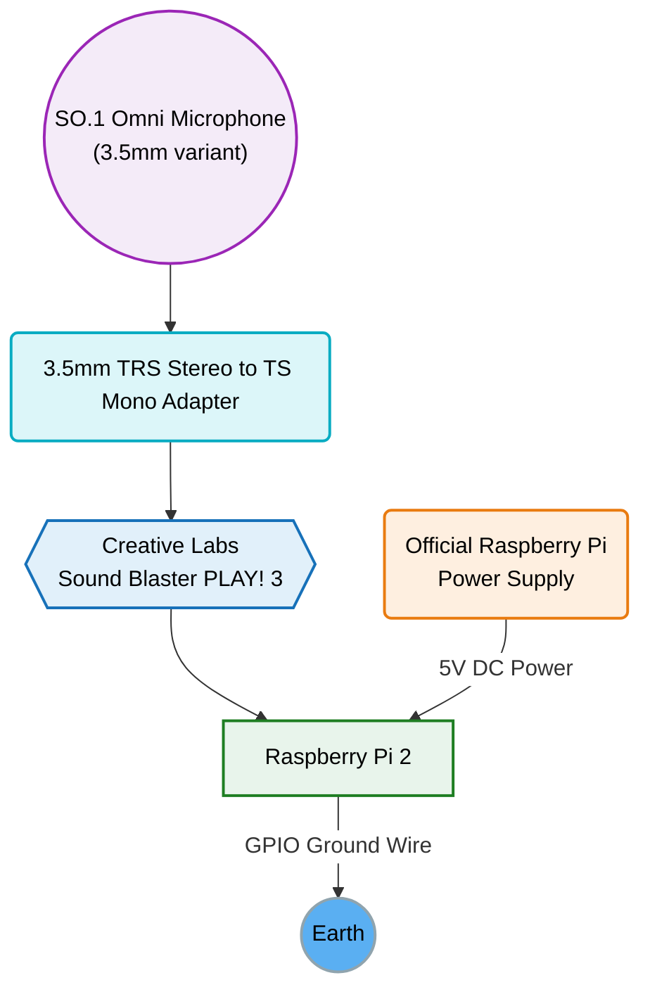

I use [BirdNET-Go](https://github.com/tphakala/birdnet-go) to detect bird calls around my house by collecting the audio from my security cameras. I [wrote about that setup last year](/blog/2025/05/backyard-bird-tracking-with-ai/). There have been a few examples where I've wanted to detect birds (like owls late at night) that are improved using more sensitive microphones than what you'll find on a security camera. Especially when the birds are further away. I figured it was time to add a higher-quality microphone to my detection array. 

My secondary goal was to continue using a single instance of BirdNET-Go for all of my detections. That would make viewing my dashboard easier. But my server is not placed appropriately to connect a microphone to it, so I followed in the footsteps of others. 



## Overview

Below is an overview of the hardware components in my setup. I'll go through the more interesting parts below.



---

The plan was to connect a high-quality microphone to a secondary compute device (in my case, a spare Raspberry Pi 2) and broadcast the audio stream over my network. At that point, I would ingest the `RTSP` stream in BirdNET-Go. 

Why on earth would I choose a Raspberry Pi 2 for this project? I had an extra one sitting in a bin doing nothing ♻️.

I planned to run [mediamtx](https://github.com/bluenviron/mediamtx) on the Pi and stream the microphone audio to the network over `RTSP` and pick it up in BirdNET-Go.

## Raspberry Pi

First, I had to set up my Raspberry Pi 2 using the Raspberry Pi Imager tool:

- <https://www.raspberrypi.com/software/>

Since I'm running an older model (in headless mode), I decided to install Raspberry Pi OS Lite.

- <https://www.raspberrypi.com/software/operating-systems/>

After the install, I booted up my Pi and ran updates before installing any of my tools.

```bash
sudo apt update
sudo apt upgrade -y
```

### Watchdog

The Raspberry Pi has a hardware feature on it called a watchdog. This hardware will automatically reboot the Raspberry Pi if its countdown circuit reaches 0.

This is optional, but I set it up on my Raspberry Pi since I didn't intend to keep an eye on it (and it's better safe than sorry). 

#### Hardware Configuration

First, configure the hardware settings for the watchdog. 

Open the configuration file.

```bash
# or `nano` if you've never used `vi` before
sudo vi /etc/systemd/system.conf
```

Then append the following lines at the bottom.

```bash
RuntimeWatchdogSec=15
RebootWatchdogSec=5min
```

- `RuntimeWatchdogSec=15` sets a 15-second timeout. The system will continuously ping the hardware watchdog. If it doesn't check in after 15 seconds, a hard reboot will be triggered.
- `RebootWatchdogSec=5min` sets a 5-minute deadline during the final phases of the shutdown/reboot process. If this deadline is exceeded, a hard reboot will be triggered. 

Now we reload the daemon (or reboot the system) to ensure our changes are loaded.

```bash
sudo systemctl daemon-reload
# (or reboot)
```

#### Software Configuration

This is the software component of the watchdog. These settings are how we define the conditions to invoke the watchdog.

```bash
sudo apt install watchdog
```

```bash
# or `nano` if you've never used `vi` before
sudo vi /etc/watchdog.conf
```

```bash
watchdog-device = /dev/watchdog
watchdog-timeout = 15
max-load-1 = 24
interface = wlan0
```

- `watchdog-device = /dev/watchdog`: This connects the software daemon to the physical hardware timer chip.
- `max-load-1 = 24`: If the 1-minute CPU load average spikes above 24, the daemon assumes the system is going to remain unresponsive.
- `interface = wlan0`: If the Wi-Fi interface goes down, hangs, or loses its connection, the daemon triggers the hardware reset.

#### Enable the Watchdog

```bash
sudo systemctl enable watchdog
sudo systemctl start watchdog
```

## Docker

Next, I installed Docker on my Pi. It's not necessary, but I'm very comfortable using it, and it makes upgrading or migrating my setup a lot easier. 

> These steps largely follow an existing Docker setup guide by [Pi My Life Up](https://pimylifeup.com/raspberry-pi-docker/). Check them out!

```bash
# Install Docker
curl -sSL https://get.docker.com | sh

# Modify our user group to include `docker`. 
# Without this, we'd need root to make any Docker changes.
sudo usermod -aG docker $USER

logout
# or `sudo reboot`

# Check groups and confirm that `docker` has been added to the user
groups

# Test Docker is working
docker run hello-world
```

## Mic Setup

Your options are endless here. A lot of people will recommend either building your own microphone with an EM272 capsule, or buying one with it already in it. This specific module is popular because it has an extremely low self-noise (14 dBA) and a high sensitivity rating (-28 dB).

I wanted to avoid _another_ rabbit hole, so I decided to purchase a pre-assembled microphone using the EM272. I went with the `SO.1 Omni Microphone (3.5mm variant)`. While XLR inputs are balanced (and less prone to interference), I didn't feel my application warranted researching and purchasing an XLR pre-amp for something that I was only going to be using for AI detection (rather than proper field recordings).

I went with an omnidirectional mic to pick up birds from all directions.

*SO.1 Omni Microphone magnetically mounted under a deck joist*

I mounted my microphone under the deck in a way that minimizes the amount of rain that can soak the windscreen. As long as I don't spray water directly at it, it should be fine.

Since the Raspberry Pi 2 doesn't have a mic input, I paired the `SO.1 Omni Microphone` with a USB `Sound Blaster PLAY! 3`. It's pretty affordable and has been around since 2017. 

The last component in my hardware chain was a `3.5mm TRS Stereo to TS Mono Adapter`. This allowed the TS (Mono) signal coming from my microphone to connect properly to the TRS (Stereo) microphone input of the `Sound Blaster PLAY! 3`.

### Identify mic

Once the microphone is connected to the USB sound card, you can identify the audio device with: 

```bash
arecord -l
```

You will see output that looks something like this:

```bash
**** List of CAPTURE Hardware Devices ****
card 1: Device [USB Audio Device], device 0: USB Audio [USB Audio]
```

Note the card number and device number. In this example, it's `Card 1, Device 0`. This translates to `hw:1,0`.

Create a new `mediamtx.yml` config file in your `$HOME` (`~`) folder.

```bash
# or `nano` if you've never used `vi` before
vi ~/mediamtx.yml
```

Then paste in the following configuration. Make sure to account for your different values for `-i hw:1,0`. 

```yaml
paths:
  birdmic:
    # Optimized for a sheltered/wind-protected location. 
    runOnInit: ffmpeg -f alsa -thread_queue_size 1024 -ac 2 -ar 48000 -i hw:1,0 -af "highpass=f=120" -ac 1 -c:a aac -b:a 256k -f rtsp rtsp://localhost:8554/birdmic
    runOnInitRestart: yes
```

### FFmpeg Input

- `-f alsa`: Forces FFmpeg to use the Advanced Linux Sound Architecture (ALSA) driver to capture audio directly from the host machine.
- `-thread_queue_size 1024`: Increases the queue size for reading from the microphone because ALSA is notorious for dropping packets.
- `-ac 2`: Expects a 2-channel (stereo) input from the microphone. Even though our mic is mono, the soundcard isn't.
- `-ar 48000`: Sets the sample rate to 48,000 Hz (48 kHz) as recommended by BirdNET-Go.
- `-i hw:1,0`: My microphone's physical input device (previously identified).

### Filter

- `-af "highpass=f=120"`: Filter to block frequencies below 120 Hz. e.g., wind, traffic, or HVAC units. It's a personal choice to filter it here.

### FFmpeg Output

- `-ac 1`: "Downmixes" to mono (even though it was basically mono this whole time).
- `-c:a aac`: Encodes in aac to because it's efficient, and I feel like lossless would help me that much here? (unless you're detecting bats!).
- `-b:a 256k`: Output bitrate. Seems high enough.
- `-f rtsp`: Force the output protocol to `RTSP` so I can pick it up in BirdNET-Go.
- `rtsp://localhost:8554/birdmic`: The local destination URL where the MediaMTX server is listening to ingest and publish the stream.

## Docker Compose

I use Docker Compose to manage and automatically start my Docker containers on boot.

```bash
# or `nano` if you've never used `vi` before
vi ~/docker-compose.yml
```

```yaml
services:
  mediamtx:
    # We MUST use the ffmpeg tag so the runOnInit command works
    image: bluenviron/mediamtx:latest-ffmpeg
    container_name: mediamtx
    # Host network mode is highly recommended for RTSP/UDP traffic on weak hardware
    network_mode: host 
    restart: always
    devices:
      - /dev/snd:/dev/snd # Passes the physical sound cards into the container
    volumes:
      - ./mediamtx.yml:/mediamtx.yml # Mounts the config file
```

Start the Docker container.

```bash
docker compose up -d
```

## View Logs

Honestly, if it worked the first time, great! Mine sure didn't. Here's how you pull up the Docker logs to find out what errors were thrown. Then you fix them! 🔥

```bash
docker logs mediamtx
```

## Stream URL

If the logs look good, go ahead and bring your `RTSP` stream into BirdNET-Go as a new microphone. 

The URL will be something like this, where `10.0.0.123` is the IP address of _your_ device:

```bash
rtsp://10.0.0.123:8554/birdmic
```

## Floating Ground Problems

If you're smarter than me, you may have already realized one of my mistakes.

When I first started the stream of my `SO.1 Omni Microphone (3.5mm variant)`, it sounded like trash. There was such a loud buzzing that I thought my cables weren't plugged in all the way.

I forgot that my Raspberry Pi doesn't have a path back to ground. Rather than a traditional ground loop, this creates a _floating ground_ issue for me. Even when running the "Official Raspberry Pi power supply", I ran into problems because it's a switch-mode power supply.

This is what I think is happening. 

Inside my switch-mode power supply, a capacitor links the AC wall power to the USB's DC output to filter out electrical noise. Capacitors naturally block DC power, but they allow AC to pass through. Since the power supply only has two prongs and no earth ground pin to drain the noise, that tiny amount of AC wall voltage travels along the USB cable's ground wire and sits directly on the Pi's ground.

Because the whole system's ground reference is floating with this AC leakage, my microphone cable acts as a giant antenna. It picks up the 60Hz mains hum along with its stacked harmonics (120Hz, 180Hz, 240Hz). This is the buzzing sound that I was hearing.

You can _totally_ fix this by grounding the Pi so the leaking voltage has somewhere to drain. One option is connecting the GND GPIO pin to your outlet using an ESD Ground Plug Adapter (without a resistor). 

Here I was temporarily testing the ground on my utility sink casing (which is grounded through my copper plumbing).

*Raspberry Pi 2 with a temporary GPIO ground wedged into a utility sink gap*

> If you connect your Raspberry Pi GND pin to earth ground, there isn't really any protection if an appliance shorts to ground. I accepted this risk for my Pi given that I wasn't getting any value from it in storage.

That doesn't necessarily mean grounding the Pi will fix *every* noise problem. It depends heavily on your power topology (ground loops), how well your equipment is shielded, and how long your run is.

The final results from grounding my Pi were great! Forgive the extra noise in the spectrum. The wind blowing the leaves on the trees made this visualization far less impressive:

*Spectrum analysis results when I remove the ground wire from my Raspberry Pi.*

---

Here's what it _sounds_ like when the ground issue is fixed. 🔊



*August 3, 2026 @ 21:30:12*

🔊: *A chorus of crickets, an **Eastern Screech-Owl**, and a **Barred Owl** responding at the end of the clip. And yea, the screech-owl kinda sounds like a horse. 🐴*

---

Here are some other _possible_ solutions to the grounding problems that are more appropriate than connecting the GPIO GND pin to earth:

- **USB Power Bank**: This _did_ work for me and eliminated my extra noise since there is no AC/DC conversion happening. But it only works until the battery runs out.
- **USB Isolator**: This attempts to fix ground loop issues by decoupling the circuits between devices. Be aware that not all isolators supply enough power for USB sound cards, and many only support "Full Speed" (12 Mbps) instead of "High Speed" (480 Mbps).
- **Linear USB Power Supply**: I'm certain this would have worked. But it's also a lot more expensive than me running a GND GPIO wire to my home's ground wiring.
- **XLR Microphone**: XLR cables are "balanced", so the floating ground noise shouldn't impact an XLR microphone. This requires spending more money on a decent XLR microphone pre-amp.

In the end, it all came down to the fact that I was running most of this with cheap hardware I already owned. I didn't want to spend _more_ money on it without some reasonable return on it.

If I didn't already have this gear, I probably would have considered going the XLR route to ensure my setup stays balanced. If I add additional microphones, I'll definitely go this path. But instead, I went the budget route and achieved _similar_ results.

*Raspberry Pi 2 with a fixed ground wire on a GPIO breakout header*

## Conclusion

It works.

This setup has provided me with some good detections of nocturnal birds, fledglings, and distant birds. 

My setup hasn't given me any problems all summer. I'm looking forward to what I'll pick up in the winter after the leaves drop. 🍁🦉
