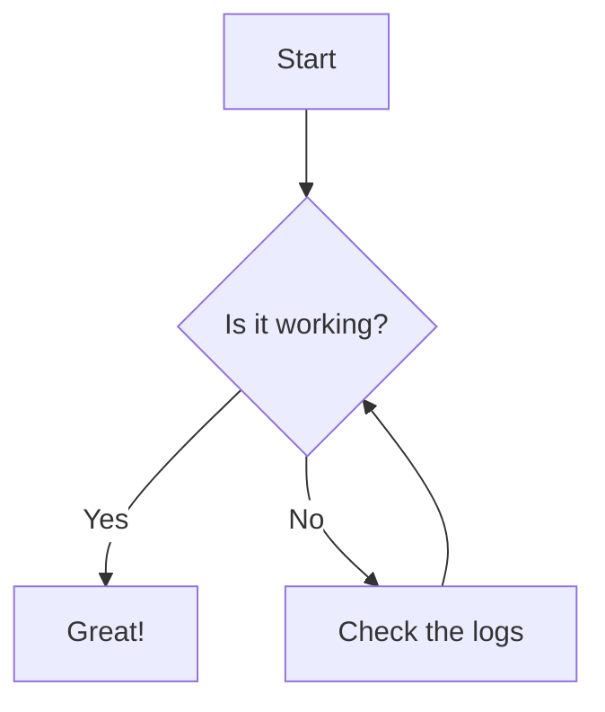

Our bedroom is at the end of an HVAC trunk. It gets uncomfortably warm. Not enough to keep us awake, but warmer than we would prefer. We love colder weather. The airflow from the supply register in this room isn't spectacular. There isn't a blockage. It's just a suboptimal design from the 1970s.

From testing, we could see the the thermostat in our kitchen had no problem reaching our setpoint temperature. But our bedroom always lagged behind a couple degrees from our setpoint.

In the summer of 2021, I decided to dig into a bit more a came up with a list of things I could try.

1. (2020) Fix gaps using thermal camera
2. (2021) Additional insulation
3. (2021) New roof with better ventilation (ridge vent)
4. (2023) Window air conditioner (until wildfire smoke)
5. (2024) Close basement supply registers/dampers to force air to the main floor.
6. (2025) Lower the thermostat.
7. (2026) Duct or vent booster fans + smart ceiling fan automations

I did some testing a partially closed some dampers and supply registers in our basement to force our air 

In 2024, our bedroom got hot.


- ceiling fan
- in 2025, closed vents
- in 2026, added baseboard register booster fan controlled by ESPHome. Also lowered the temperature a degree


- biggest bang for buck is a ceiling fan. Technology connections video: https://www.youtube.com/watch?v=_KWdCqpXB7A
- closing basement registers


Lorem ipsum dolor sit amet consectetur adipiscing elit. Quisque faucibus ex sapien vitae pellentesque sem placerat. In id cursus mi pretium tellus duis convallis. Tempus leo eu aenean sed diam urna tempor. Pulvinar vivamus fringilla lacus nec metus bibendum egestas. Iaculis massa nisl malesuada lacinia integer nunc posuere. Ut hendrerit semper vel class aptent taciti sociosqu. Ad litora torquent per conubia nostra inceptos himenaeos.

- Blog post on register vent fans to boost duct
- Fan at the end of duct (above basement trunk) doesn't pull up air. So added a booster at the vent to pull it up and help assist when HVAC fan is running.
- Leave it running 24/7 since it's quiet (under the bed anyway).
- Works by helping cooler air make it up. Closing vents isn't enough with old leaky ducting like ours. Just helps with the imbalance of all cold air going downstairs by raising the static pressure to this room. 
- Temperature difference incredibly difficult to measure.
- Chose fans with static pressure that are good. Calculate power consumption.
- Provide ESPHome code config (and why I modified it). Check if project has pulled in these changes. 
  - https://github.com/zeroflow/wifi-fancontroller
- Provide data if I can; but note it's difficult to tell since there are too many variables to account for. Like we also run the ceiling fan to pull air from out under the bed.
- 

<!-- ## Table of Contents -->



<!-- If an HTML tag has an attribute markdown="block", then the content of the tag is parsed as block level elements. -->
<!-- https://kramdown.gettalong.org/syntax.html#html-blocks -->
<details markdown="block">

<summary>Changelog</summary>

> - 2026-07-13: Changelog Entry #1
> - 2026-07-14: Changelog Entry #2
> - 2026-07-15: Changelog Entry #3

</details>

## Example Post

Lorem ipsum dolor sit amet consectetur adipiscing elit. Quisque faucibus ex sapien vitae pellentesque sem placerat. In id cursus mi pretium tellus duis convallis. Tempus leo eu aenean sed diam urna tempor. Pulvinar vivamus fringilla lacus nec metus bibendum egestas. Iaculis massa nisl malesuada lacinia integer nunc posuere. Ut hendrerit semper vel class aptent taciti sociosqu. Ad litora torquent per conubia nostra inceptos himenaeos.

## Callout

> Example callout

[This is a link](https://example.com)



## Image

*Noctua fans assembled*

*Baseboard register with wiring grommet installed*

*Empty baseboard register*

*Lots of air leakage on the sides when fit like this, which reduces static pressure.*

*Baseboard register doesn't reassemble completely with the fans angled like this.*

*Register fans fit perfectly when inserted into ductwork at an angle*

*Baseboard register closed with fan array inserted perfectly*

*Before and after new insulation was installed in the attic*

*Chart showing how little our A/C kicked on the day we had our new insulation installed*

*Year-over-year summer nighttime temperature delta: bedroom vs. kitchen (2024–2026)*

*Average temperatures in the summer recorded by my bedroom and kitchen from 2024-2026*

*Thermal camera revealing an uninsulated stud bay*

## Remove Metadata

```bash
exiftool -all= -overwrite_original -r .

exiftool -gpslatitude .
```

## Line Numbers


exiftool -all= -overwrite_original -r .

exiftool -gpslatitude .


## Table

{: .table-post}
| Syntax      | Description | Test Text     |
| :---        |    :----:   |          ---: |
| Header      | Title       | Here's this   |
| Paragraph   | Text        | And more      |


## Mermaid Diagram



## Details

<!-- If an HTML tag has an attribute markdown="block", then the content of the tag is parsed as block level elements. -->
<!-- https://kramdown.gettalong.org/syntax.html#html-blocks -->
<details markdown="block">

<summary>[YAML] Example Configuration</summary>

```yaml

template:
  - trigger:
      - platform: time_pattern
        # Let's be honest, we don't need to check often. 
        # But 5 minutes should be reactive enough if I need to correct an event date.
        minutes: "/5" 

```
</details>
