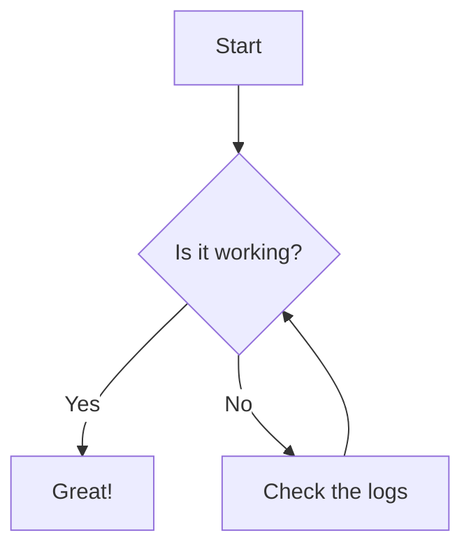

Lorem ipsum dolor sit amet consectetur adipiscing elit. Quisque faucibus ex sapien vitae pellentesque sem placerat. In id cursus mi pretium tellus duis convallis. Tempus leo eu aenean sed diam urna tempor. Pulvinar vivamus fringilla lacus nec metus bibendum egestas. Iaculis massa nisl malesuada lacinia integer nunc posuere. Ut hendrerit semper vel class aptent taciti sociosqu. Ad litora torquent per conubia nostra inceptos himenaeos.


<!-- ## Table of Contents -->



<!-- If an HTML tag has an attribute markdown="block", then the content of the tag is parsed as block level elements. -->
<!-- https://kramdown.gettalong.org/syntax.html#html-blocks -->
<details markdown="block">

<summary>Changelog</summary>

> - 2026-07-13: Changelog Entry #1
> - 2026-07-14: Changelog Entry #2
> - 2026-07-15: Changelog Entry #3

</details>

## Example Post

Lorem ipsum dolor sit amet consectetur adipiscing elit. Quisque faucibus ex sapien vitae pellentesque sem placerat. In id cursus mi pretium tellus duis convallis. Tempus leo eu aenean sed diam urna tempor. Pulvinar vivamus fringilla lacus nec metus bibendum egestas. Iaculis massa nisl malesuada lacinia integer nunc posuere. Ut hendrerit semper vel class aptent taciti sociosqu. Ad litora torquent per conubia nostra inceptos himenaeos.

## Callout

> Example callout

[This is a link](https://example.com)

## Image

*My security camera pointed directly at two of my bird feeders*

## Remove Metadata

```bash
exiftool -all= -overwrite_original -r .

exiftool -gpslatitude .
```

## Line Numbers


exiftool -all= -overwrite_original -r .

exiftool -gpslatitude .


## Table

{: .table-post}
| Syntax      | Description | Test Text     |
| :---        |    :----:   |          ---: |
| Header      | Title       | Here's this   |
| Paragraph   | Text        | And more      |


## Mermaid Diagram



## Details

<!-- If an HTML tag has an attribute markdown="block", then the content of the tag is parsed as block level elements. -->
<!-- https://kramdown.gettalong.org/syntax.html#html-blocks -->
<details markdown="block">

<summary>[YAML] Example Configuration</summary>

```yaml

template:
  - trigger:
      - platform: time_pattern
        # Let's be honest, we don't need to check often. 
        # But 5 minutes should be reactive enough if I need to correct an event date.
        minutes: "/5" 

```
</details>
